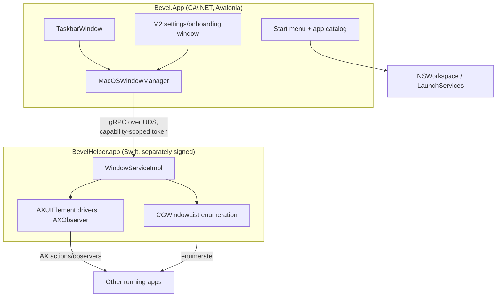
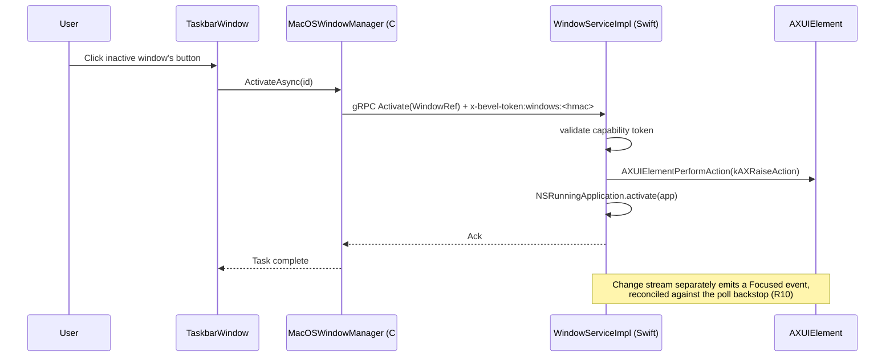
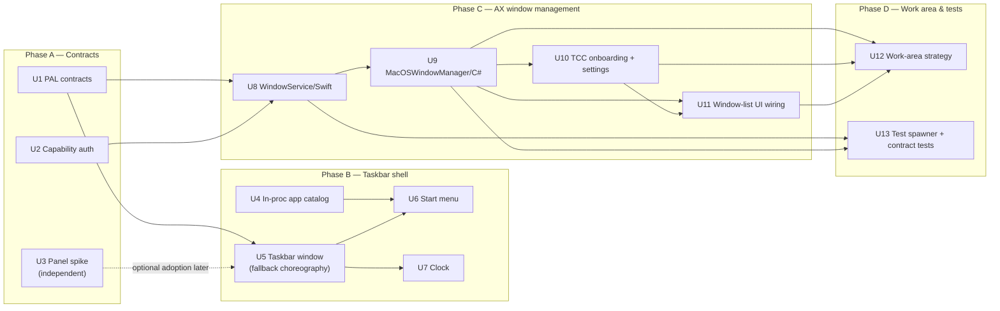

# M2 — Taskbar + AX Window Management (macOS)

## Summary

M2 builds Bevel's macOS taskbar: a real window (Start button, Start menu, running-window list, clock), a real AX-backed `IWindowManager` implementation routed through a new gRPC service in the Swift helper, Accessibility permission onboarding with a degraded mode, and the work-area (Dock) strategy the platform spec already designed. It retires the milestone's namesake risk — can Bevel manage other apps' windows at all on macOS — and is the first milestone to touch a real OS permission grant.

---

## Problem Frame

M0 and M1 shipped the bootstrap and the themed desktop/file-manager, both with zero OS permissions and zero foreign-window interaction. `Bevel.Taskbar` is still an M0 placeholder (`TaskbarModule` registers a `TextBlock` view, nothing else); every macOS PAL surface M2 needs (`IWindowManager`, work-area, permission broker) throws `NotImplementedException`; the helper's gRPC contract exposes only `Ping`. `docs/spec/02-macos-platform.md`, `docs/spec/07-shell-ux.md`, and `docs/spec/09-engineering-plan.md`'s M2 section already carry a detailed, requirement-numbered design for this milestone — this plan operationalizes that design into sequenced implementation units rather than re-deriving it.

---

## Requirements

**Taskbar chrome & positioning**
- R1. The taskbar renders on the primary display only, at macOS window level `kCGMainMenuWindowLevel-1` with `canJoinAllSpaces | stationary | ignoresCycle | fullScreenAuxiliary` collection behavior (02-macos-platform.md Req 3.1/3.2), showing Start button, Quick Launch, window-button area, and clock.
- R2. Clicking the taskbar does not activate Bevel over the frontmost app; the interim behavior is activate-then-immediately-refocus-previous-app, documented as a focus-flicker tradeoff (02 Req 3.6 path 2).
- R3. The taskbar re-anchors within one animation-frame budget on screen-parameter or Space changes and reassigns to the new primary display if the old one vanishes (02 Req 3.5).

**Start menu & app catalog**
- R4. The Start menu renders the Win2000 single-column cascading structure (Programs/Documents/Settings/Search/Help/Run/Log Off/Shut Down per 07-shell-ux.md §3.1) backed by real installed/running app data.
- R5. Programs cascades open on 400ms hover or immediate click, close on Escape, and support arrow-key and first-letter navigation (R-SM-1).
- R6. The Start menu opens via `Ctrl+Esc` or a configurable macOS hotkey defaulting to `⌥Esc` (R-SM-3); `Ctrl+Esc` also moves keyboard focus to the Start button, establishing it as the fixed entry point into the taskbar's Tab order.

**AX-backed window management**
- R7. With Accessibility granted, the taskbar lists running apps' windows and supports activate (left-click), minimize-toggle (second left-click), and close (system menu); titles update within 500ms of a change (09-engineering-plan.md M2 acceptance criterion 1).
- R8. Without Accessibility granted, the taskbar still lists windows (geometry + app name/icon from `CGWindowListCopyWindowInfo` + `NSRunningApplication`) but disables activate/minimize/close and shows an inline "Grant Accessibility" affordance (02 Req 4.5).
- R9. Window correlation between `CGWindowListCopyWindowInfo` entries and `AXUIElement` windows uses the private `_AXUIElementGetWindow` function for an exact `CGWindowID` match, falling back to frame comparison only when that call fails.
- R10. Window change notifications (created/destroyed/focused/retitled/minimized) arrive via per-app `AXObserver` registrations, backstopped by a periodic reconciliation poll (≥1s) so a dropped notification self-heals (02 Req 4.3).
- R11. No taskbar button grouping ships in the Win2000 profile regardless of window count (R-ERA-3 forbids scheduling XP-only grouping into M2).

**TCC onboarding & degraded mode**
- R12. A first-run checklist screen shows Accessibility grant status (polled via `AXIsProcessTrustedWithOptions`) and deep-links to `x-apple.systempreferences:com.apple.preference.security?Privacy_Accessibility` (02 Req 7.1).
- R13. The shell remains fully usable with zero permissions granted — desktop, taskbar launcher, clock, and file manager all function; no permission is a hard prerequisite (02 Req 7.2).

**Work-area strategy**
- R14. The default work-area strategy is "Nudge": the Dock is set to auto-hide and moved to a side edge with consent (journaled per 02 Req 2.3), and windows overlapping the taskbar band are repositioned via AX, rate-limited and suspended while the user is dragging (02 Req 9.1/9.2).
- R15. An opt-in "Dock shim" strict mode keeps the Dock visible at minimum size and sets the taskbar height to the measured Dock inset (02 Req 9.3).
- R16. The work-area strategy is a single 3-way setting — Window nudging / Dock shim / None — with tradeoffs shown inline (02 Req 9.5).

**Helper IPC**
- R17. A new `WindowService` gRPC service on the existing Unix-domain-socket transport exposes window enumeration, activate/minimize/restore/close, and a snapshot-then-deltas change stream (02 §4.2).
- R18. Every `WindowService` RPC validates a capability-scoped auth token, not the flat all-or-nothing session nonce `SupervisionService` uses today.

**Settings & test coverage**
- R19. A minimal, M2-owned settings/onboarding window exposes permission status, the work-area strategy picker, and a startup (run-at-login) toggle that, when enabled, registers Bevel to launch its desktop and taskbar at login — the mechanism by which the shell itself starts, not an ancillary OS-integration feature (09-engineering-plan.md M2 scope).
- R20. A local test-window spawner exercises the AX window-manager path repeatably, without manual smoke-testing against real third-party apps.
- R21. `Bevel.Pal.ContractTests`'s `IWindowManager` suite runs against the real macOS implementation (macOS-runner-guarded), not only the Fake PAL.

---

## Key Technical Decisions

- **Extend the existing canonical `IWindowManager`, don't build a second interface.** Every PAL pillar in this codebase already mixes read and write on one interface (`IWindowManager`'s own `EnumerateAsync` next to `ActivateAsync`/`MinimizeAsync`/`CloseAsync` since `01-architecture.md`'s original M0 sketch; `IShellSession`, `IAppEnvironment` follow the same shape) — the split axis this codebase actually uses is capability pillar (windows vs. tray vs. desktop), enforced by ARCH-03, not read/write. Carving `RepositionAsync` out into its own interface would be a one-off exception to that convention, and — since `ARCH-03` forbids `Bevel.Taskbar` from referencing a concrete PAL, only `Bevel.Pal.Abstractions` — it would still have to live in the same project, recreating on a smaller scale the exact multiple-window-interfaces fragmentation `07-shell-ux.md` Q7 already flags. U1 absorbs `02-macos-platform.md` §4.2's needed capabilities (richer window state, the reposition primitive, a foreground-change event) into the one canonical interface instead.
- **`RepositionAsync` gets its own capability flag, not just a thrown exception on unsupported platforms.** `RepositionAsync` is expected to be meaningfully implemented on macOS only — Windows/Linux have real OS-level work-area reservation (`ReserveWorkAreaAsync` does the actual work there) and have no natural use for AX-style per-window nudging. Today's shared `Capabilities` record (`Bevel.Pal.Abstractions/Dtos.cs`) has no per-method flags, so without a `SupportsReposition` field, `WorkAreaMitigator` and any future Windows/Linux `IWindowManager` have no feature-detectable way to know reposition isn't available — only a thrown exception at call time, violating this project's own PAL-02 feature-detection rule. Adding the flag now costs one field; discovering the gap after `WorkAreaMitigator`/`FakeWindowManager`/`PalContractTests` all ship assuming universal support would cost an audit of every call site.
- **Adopt capability-scoped helper auth now, not after a second service exists.** `bevel-l3o`'s HMAC-per-capability design was written for exactly this moment — the first new gRPC service since `Ping`. Retrofitting scoped auth after `WindowService` ships plain-nonce would be strictly harder than building it in from the start; grpc-swift 2's interceptors apply uniformly to unary and streaming RPCs, so there is no technical reason to defer.
- **The non-activating panel is a non-blocking feasibility spike, not a taskbar dependency.** Avalonia is consumed as a NuGet package here, not vendored source (unlike `third_party/classic-avalonia`), so a real patch means forking and building Avalonia's native macOS backend — a genuine toolchain commitment. U5 (taskbar window) ships the documented activate-then-refocus fallback unconditionally; U3 independently investigates whether Avalonia's existing (but unexposed) `AvnPanel`/`usePanel` scaffolding can be extended with `NSWindowStyleMaskNonactivatingPanel` + `becomesKeyOnlyIfNeeded`, and its deliverable is a documented recommendation, not a merge dependency for any other unit.
- **App catalog and launch stay in-proc, not routed through the helper.** 02 Requirement 1.1 mandates the helper only for Accessibility, Screen Recording, and event-synthesis calls; `NSWorkspace`/LaunchServices enumeration needs none of those. `Bevel.Desktop/DesktopWindow.cs` already establishes the safe in-proc AppKit interop precedent this follows.
- **Window correlation uses `_AXUIElementGetWindow` as the primary strategy.** This private-but-decade-stable function (used in production by AeroSpace, alt-tab-macos, and metamove) returns an exact `CGWindowID` match; frame comparison is kept only as a fallback for the rare case it fails, since frames alone cannot disambiguate identical-bounds windows.
- **The AX reconciliation poll is load-bearing, not a fallback nicety.** External research and 02 Requirement 4.3 agree that `kAXUIElementDestroyedNotification`/`kAXWindowCreatedNotification` are routinely unreliable in production; the periodic re-enumeration poll is what actually keeps the window list correct, and is built with the `IClock`/`ManualClock` deterministic-testing seam from the start.
- **The M2 settings/onboarding window is new and separate from `Bevel.FileManager`'s `SettingsWindow`.** ARCH-03 forbids `Bevel.Taskbar` from referencing `Bevel.FileManager`, and `09-engineering-plan.md`'s own wording ("M5... extends the minimal M2 settings window") implies M2 introduces its own window that M5 later unifies — not that M2 extends M1's.
- **Work-area geometry extends `IDesktopEnvironment`/`MonitorInfo`; no macOS-specific reservation API is invented.** 02 §9 explicitly rejects any private `SetWindowWorkarea`-style call. The cross-platform `ReserveWorkAreaAsync` shape is kept (Windows/Linux have real reservation APIs); macOS's implementation reinterprets "reserve" as the Nudge dance, with the AX overlap-mitigation engine as taskbar-side orchestration over `IWindowManager`'s new reposition primitive.
- **A local test-window spawner substitutes for the full M-INFRA rig.** The specced self-hosted-CI/`WindowZoo.app` milestone (`09-engineering-plan.md` M-INFRA) was never built, and standing it up is a multi-week infrastructure investment orthogonal to "can the taskbar manage windows" — the risk this milestone actually retires. A lightweight local spawner gives U8/U9 repeatable coverage now; the full rig remains available as a later investment once the CI runner fleet exists (user-confirmed in scoping).

---

## High-Level Technical Design

### Component topology



`Bevel.Pal.Abstractions.IWindowManager` is the seam between `TaskbarWindow`/`MacOSWindowManager` and everything downstream; the Start menu's app catalog never crosses the helper boundary (Key Technical Decisions).

### Window-activate sequence



### Phased dependency flow



### Work-area strategy modes

| Setting | Dock state | Taskbar height | Overlap behavior | Affordances lost |
|---|---|---|---|---|
| Window nudging (default) | Auto-hidden, side edge | Themed (30 logical px) | AX repositions overlapping windows, rate-limited | None |
| Dock shim (strict, opt-in) | Visible, minimum size | Inflated to measured Dock inset | None needed — Dock reserves the space | Badges, bounce, drag-to-Dock, Dock context menu |
| None | User's existing setting | Themed | No mitigation; windows may underlap the bar | None, but visual overlap is possible |

---

## Scope Boundaries

**Deferred to follow-up work**
- Quick Launch as a functional pinned-shortcut region — U5's taskbar skeleton renders the Quick Launch area as a placeholder only; a working implementation is deferred as one instance of a future pluggable-toolbars mechanism (multiple user-addable/reorderable toolbars, matching classic Win2000's Quick Launch/Address/Links toolbar model), not a bespoke M2-only feature.
- Standing up a permanent forked-Avalonia build/package pipeline, regardless of U3's spike outcome — M2 only needs the spike's recommendation, not a shipped fork.
- The fully faithful read-only Date/Time Properties dialog (month grid, analog second hand, timezone dropdown — R-CL-2); U7 ships display + tooltip + a deep-link to system settings only.
- Reconciling the stale "Dock auto-hide + shim" wording still present in `docs/spec/07-shell-ux.md` line 326 and `docs/spec/08-os-interop.md` §4.1 against `02-macos-platform.md` §9's actual decision — a doc-only fix, orthogonal to this plan's code units.
- A `NetArchTest`-based enforcement of ARCH-02/ARCH-03 module-reference rules — specced but never built; not this plan's concern.

**Outside this milestone's identity**
- Systray/tray mirroring, menu-bar reclaim, and any tray widgets — M3 (`09-engineering-plan.md`).
- XP/W11-only behaviors: taskbar button grouping, per-monitor taskbars, calendar flyouts — forbidden from M2 scheduling by R-ERA-3.
- Apple Events / Finder scripting compatibility — M4.
- Full Finder replacement (loginwindow key) — a separate, later-v1.x gated track (02 §2.2).
- The full M-INFRA self-hosted-CI/WindowZoo rig milestone — never built; U13's local spawner is scoped to this plan's own test needs only.

---

## System-Wide Impact

This is the first milestone to extend the shared `Bevel.Pal.Abstractions` contract since M0/M1 stabilized it — `IWindowManager`, `IDesktopEnvironment`, and `MonitorInfo` changes (U1) ripple into `Bevel.Pal.Fake` and any future Windows/Linux PAL implementations, not just macOS. It is also the first milestone adding a second gRPC service to the helper, so the capability-scoped auth model introduced here (U2) becomes the pattern every later service (`TrayService`, `InputService`, `SessionService`, `ScriptingService`) follows. It is the first milestone requiring a real OS permission grant, so the onboarding UX and degraded-mode discipline established here (U10) sets precedent for Screen Recording and Full Disk Access onboarding in later milestones.

`WindowService` is also this milestone's new helper-crash failure surface: `02-macos-platform.md` Requirement 1.2 already specifies the shell's general degradation contract on helper death (tray freezes to last-known frames, taskbar window-control buttons grey out, relaunch with backoff) — U9's `MacOSWindowManager` must honor that same contract specifically for an in-flight `Activate`/`Minimize`/`Close`/`Changes`-stream call: surface a clear "helper unavailable" result rather than hanging, and resubscribe the `Changes` stream (snapshot-then-deltas, so a fresh snapshot after reconnect is correct by construction) once `HelperLifecycle` reports the helper back.

---

## Implementation Units

### U1. Extend PAL contracts for M2

**Goal:** Absorb `02-macos-platform.md` §4.2's needed window-management capabilities into the canonical `Bevel.Pal.Abstractions.IWindowManager`, and extend `MonitorInfo`/`IDesktopEnvironment` with what work-area orchestration needs, resolving `07-shell-ux.md` Q7's consolidation gap rather than building a parallel interface.

**Requirements:** R9, R10, R14, R17 (contract prerequisites)

**Dependencies:** none

**Files:**
- `src/Bevel.Pal.Abstractions/Interfaces.cs` — add `RestoreAsync`, a `ForegroundChanged` event, and `RepositionAsync` to `IWindowManager`
- `src/Bevel.Pal.Abstractions/Dtos.cs` — enrich `ForeignWindow` (bounds, app-grouping key already present via `AppId`); add position/origin to `MonitorInfo`; add a `SupportsReposition` flag to `Capabilities` so callers feature-detect instead of catching exceptions on platforms without AX-style nudging
- `src/Bevel.Pal.Fake/FakePal.cs` — update `FakeWindowManager`/`FakeDesktopEnvironment` to the new shapes
- `tests/Bevel.Pal.ContractTests/PalContractTests.cs` — extend the `IWindowManager` contract theory to cover the new members
- `tests/Bevel.Pal.ContractTests/PalContractTests.Tests.cs` (new, or extend existing file) — unit tests for the contract additions

**Approach:** Keep `ReserveWorkAreaAsync`'s existing signature for cross-platform compatibility; macOS's future implementation (U12) reinterprets "reserve" as the Nudge dance rather than a literal OS call. Add the reposition primitive as `Task RepositionAsync(ForeignWindowId id, Rect bounds, CancellationToken ct)` so U12's overlap-mitigation engine has something concrete to call.

**Patterns to follow:** `src/Bevel.Pal.Fake/FakePal.cs`'s existing side-effect-free, canned-data style; `tests/Bevel.Pal.ContractTests/PalContractTests.cs`'s `[Theory]`/`MemberData` parameterization pattern.

**Test scenarios:**
- Happy path: `FakeWindowManager.RestoreAsync` completes without throwing; `FakeDesktopEnvironment.GetMonitorsAsync` returns `MonitorInfo` with non-zero position for a non-primary monitor.
- Edge case: `ForegroundChanged` fires exactly once when `FakeWindowManager` simulates a focus change, not on every enumeration.
- Edge case: a `Capabilities.SupportsReposition == false` PAL is a valid, testable state — `FakeWindowManager` should support constructing one, so `WorkAreaMitigator` (U12) has something to feature-detect against in tests.
- Contract: the extended `PalContractTests.WindowManagers()` theory asserts only that `RepositionAsync` does not throw for a capable PAL — never that the requested bounds took effect, matching R14/§9.2's own best-effort/jitter caveat — so the contract doesn't over-promise reliability no real implementation can honestly meet.
- Contract: the existing `PalContractTests.WindowManagers()` theory still passes with the extended interface shape (no breaking change to `EnumerateAsync`/`ActivateAsync`/`MinimizeAsync`/`CloseAsync` call sites elsewhere in the codebase).

**Verification:** `Bevel.Pal.Fake`, `Bevel.Pal.Abstractions`, and `Bevel.Pal.ContractTests` build and their test suites pass; no other project's build breaks from the interface change.

---

### U2. Capability-scoped helper authentication

**Goal:** Replace the flat per-session nonce auth on helper RPCs with `bevel-l3o`'s per-capability HMAC scheme, so the new `WindowService` (U8) is scoped from day one.

**Requirements:** R18

**Dependencies:** none

**Files:**
- `src/Bevel.Ipc/HelperClient.cs` — `Connect` gains a capability set; typed sub-client helpers attach only their own capability header
- `native/helper-macos/Sources/BevelHelper/SupervisionServiceImpl.swift` — migrate to capability-checked auth (`x-bevel-token: supervision:<hmac>`)
- `native/helper-macos/Sources/BevelHelper/BevelHelper.swift` — wire a shared `ServerInterceptor` validating the capability-scoped token uniformly across services
- `src/Bevel.Pal.MacOS/HelperLifecycle.cs` — nonce generation stays; the token passed via `--token` becomes the HMAC key, not the token itself
- `tests/Bevel.Pal.MacOS.Tests/HelperClientTests.cs` — cover the new header shape

**Approach:** One `ServerInterceptor` (grpc-swift 2) validates `x-bevel-token: <capability>:<HMAC-SHA256(nonce, capability)>` against `StreamingServerRequest.metadata`, which is present uniformly whether the underlying RPC is unary or server-streaming — no per-RPC-kind branching needed. Constant-time compare, matching the existing `SupervisionServiceImpl` discipline.

**Patterns to follow:** `src/Bevel.Ipc/HelperClient.cs`'s existing `BuildAuthMetadata` helper and `x-bevel-token` header convention; the existing constant-time comparison in `SupervisionServiceImpl.swift`.

**Test scenarios:**
- Happy path: a request bearing a correctly-derived `supervision:<hmac>` token succeeds against `Ping`.
- Error path: a request bearing a token derived for the wrong capability (e.g. `windows:<hmac>` against `Ping`) is rejected with `unauthenticated`.
- Error path: a missing or malformed `x-bevel-token` header is rejected, matching today's behavior.
- Integration: `HelperClient.Connect` with a capability set produces a client whose calls carry only that capability's header — verified by inspecting outgoing metadata in a test double transport.

**Verification:** `Bevel.Pal.MacOS.Tests` and `Bevel.Ipc` tests pass; the helper's existing `Ping` round-trip (used by `HelperLifecycle`'s readiness poll) still succeeds end-to-end.

---

### U3. Non-activating taskbar window feasibility spike

**Goal:** Determine, with a working local proof-of-concept if feasible, whether Avalonia's existing but unexposed `AvnPanel`/`usePanel` native scaffolding can be extended into a true non-activating panel window, per `02-macos-platform.md` Requirement 3.6's explicit "M2 spike" ask.

**Requirements:** R2 (informs, does not gate)

**Dependencies:** none (does not block U5 or any other unit)

**Files:**
- No repo files change unless the spike succeeds and a follow-up bead is filed to carry the patch forward; this unit's artifact is a written recommendation (e.g. `docs/spec/02-macos-platform.md`'s Open Question #9 updated with a resolution)

**Approach:** Timebox to a fixed budget (a few days, not weeks). Clone `AvaloniaUI/Avalonia` at the tag matching the pinned `11.3.18` package version; attempt the patch pairing external research identified — set `NSWindowStyleMaskNonactivatingPanel` on `AvnPanel`'s style mask at creation time, set `becomesKeyOnlyIfNeeded = YES`, and add a `ShouldActivateOnShow`-style override (mirroring Qt's `WA_ShowWithoutActivating` pairing) that Bevel can set `false` unconditionally on the taskbar window. Build locally and smoke-test that clicking the patched panel does not activate the host app. Write up the finding either way.

**Test scenarios:**
- Test expectation: none — this unit's deliverable is a documented feasibility finding, not shipped code; if a proof-of-concept is produced, its own manual verification (does clicking activate the app or not) is the test, not an automated suite.

**Verification:** A written recommendation exists (adopt now / adopt later via a filed follow-up bead / do not pursue), with the reasoning and, if attempted, the patch diff preserved for the follow-up bead to reference.

---

### U4. Real in-proc `IAppEnvironment` (macOS)

**Goal:** Implement installed-app enumeration, running-app tracking, and launch entirely in-process (no helper, no elevated permission), backing the Start menu's app catalog.

**Requirements:** R4

**Dependencies:** none

**Files:**
- `src/Bevel.Pal.MacOS/MacOSAppEnvironment.cs` (new, extracted from the `MacOSPal.cs` stub)
- `src/Bevel.Pal.MacOS/MacOSPal.cs` — remove the stub `MacOSAppEnvironment` class body
- `src/Bevel.Pal.MacOS/AppKitInterop.cs` (new) — small NSWorkspace P/Invoke bridge (enumerate `/Applications`, `/System/Applications`, `~/Applications`; `NSWorkspace.runningApplications`; `NSWorkspace.openApplication`)
- `tests/Bevel.Pal.MacOS.Tests/MacOSAppEnvironmentTests.cs` (new)

**Approach:** Per `07-shell-ux.md` §3.2's table: no native hierarchy exists, so synthesize a Programs tree from `/Applications`' actual subfolder structure; watch the three roots with `FSEvents` (or a `FileSystemWatcher` if .NET's cross-platform watcher suffices on macOS) for live updates. `LaunchAsync` uses `NSWorkspace.openApplication(at:configuration:)`, not `Process.Start`, so LaunchServices activation and single-instance semantics behave normally (R-SM-4).

**Patterns to follow:** `src/Bevel.Desktop/DesktopWindow.cs`'s in-proc AppKit P/Invoke precedent (this is the second consumer — worth factoring shared `objc_msgSend`/selector-lookup helpers here rather than a third private copy, since `MacOS/AppKitInterop.cs` is exactly what `02-macos-platform.md` §3.1 already calls for as the centralized location).

**Test scenarios:**
- Happy path: enumerating a temp directory structured like `/Applications` (with a subfolder, e.g. `Utilities/`) yields a `ProgramsTree` with a matching folder node.
- Edge case: an empty applications directory yields an empty but non-null catalog.
- Error path: `LaunchAsync` with a non-existent app path surfaces a clear failure rather than hanging or throwing an unhandled native exception.
- Integration: creating/deleting a `.app` bundle under the watched root updates the live `Apps` collection within a bounded time, without restarting the shell.

**Verification:** `Bevel.Pal.MacOS.Tests` passes; a manual run on a real Mac shows the real installed-app list (not canned Fake-PAL data) when launched with `--pal=macos`.

---

### U5. Taskbar window skeleton + app-startup wiring

**Goal:** Create `TaskbarWindow`, position it per `02-macos-platform.md` Requirement 3.1/3.2, and show it at app startup alongside `DesktopWindow` — closing the single biggest missing piece for M2 (no taskbar window exists today, only a placeholder view).

**Requirements:** R1, R2, R3

**Dependencies:** U1

**Files:**
- `src/Bevel.Taskbar/TaskbarWindow.cs` (new)
- `src/Bevel.Taskbar/TaskbarModule.cs` — register `TaskbarWindow` as transient
- `src/Bevel.Taskbar/TaskbarView.axaml`/`.axaml.cs` — replace the placeholder `TextBlock` with the layout skeleton (Start button · Quick Launch · window-button area · tray placeholder · clock), per `07-shell-ux.md` §2.1
- `src/Bevel.App/App.axaml.cs` — construct and `.Show()` the taskbar window on the primary display, alongside the existing `DesktopWindow` construction
- `src/Bevel.Pal.MacOS/AppKitInterop.cs` — extend with the taskbar's window-level/collection-behavior calls (shared with U4's NSWorkspace bridge and `DesktopWindow`'s existing private `NativeMac`/`Selector` classes, now centralized)
- `tests/Bevel.Taskbar.Tests/TaskbarWindowTests.cs` (new — new test project if one doesn't already exist for `Bevel.Taskbar`)

**Approach:** Mirror `DesktopWindow.cs`'s `OnOpened`-time native-behavior application, but with `TaskbarWindow`'s own level (`kCGMainMenuWindowLevel-1`) and collection behavior (adds `ignoresCycle | fullScreenAuxiliary` beyond `DesktopWindow`'s set). Ship R2 via the interim choreography: on click, if Bevel becomes active, immediately call `NSRunningApplication.activate` on the previously-frontmost app (tracked via `NSWorkspace.frontmostApplication` sampled just before the click routes). Primary-display resolution reads the (U1-enriched) `MonitorInfo.IsPrimary` position. Re-anchor on `NSApplicationDidChangeScreenParametersNotification` per Requirement 3.5.

**Patterns to follow:** `src/Bevel.Desktop/DesktopWindow.cs` end to end (constructor, `OnOpened`, `ApplyDesktopBehaviors`); `tests/Bevel.FileManager.Tests/CompositionWiringTests.cs`'s DI-resolve-and-show smoke-test template.

**Test scenarios:**
- Happy path: `TaskbarWindow` resolved from a real `ServiceCollection` + `TaskbarModule.ConfigureServices` shows without throwing (mirrors `CompositionWiringTests.cs`'s pattern).
- Happy path: on a real Mac, the taskbar window reports the level/collection-behavior values Requirement 3.1 specifies (inspect via the native handle in a manual/integration check).
- Edge case: with only one monitor, the taskbar shows on it; with two, it shows on whichever `MonitorInfo.IsPrimary` is true.
- Integration: simulating a screen-parameter-change notification triggers re-layout within the test's assertion window, without a real display reconfiguration.

**Verification:** `Bevel.Taskbar.Tests` passes; `dotnet run --project src/Bevel.App -- --pal=macos` shows a visible taskbar window at the bottom of the primary display that does not steal focus when clicked.

---

### U6. Start menu wired to the app catalog

**Goal:** Render the Win2000 single-column cascading Start menu, backed by U4's real app catalog.

**Requirements:** R4, R5, R6

**Dependencies:** U4, U5

**Files:**
- `src/Bevel.Taskbar/StartMenu.axaml`/`.axaml.cs` (new)
- `src/Bevel.Taskbar/TaskbarView.axaml.cs` — wire the Start button's click/hotkey to open the menu
- `tests/Bevel.Taskbar.Tests/StartMenuTests.cs` (new)

**Approach:** Structure per `07-shell-ux.md` §3.1's table (Windows Update hidden by default, Programs/Documents/Settings/Search/Help/Run/Log Off/Shut Down). Documents = own-MRU only, fed by the file manager (no `sharedfilelist` parsing — the spec's resolved stance). Cascade opens after 400ms hover or on click; diagonal "banana" pointer tracking so moving toward an open submenu doesn't close it prematurely.

**Patterns to follow:** `src/Bevel.FileManager/Components/ContextMenuBuilder.cs`'s Win2000 menu-construction conventions (bevel-38y era work); existing keyboard-navigation patterns in `src/Bevel.FileManager/Components/ItemView.axaml.cs`.

**Test scenarios:**
- Happy path: opening the Start menu shows Programs, Documents, Settings, Search, Help, Run, and Log Off/Shut Down items in the specified order.
- Happy path: `Ctrl+Esc` opens the menu; `Escape` closes it.
- Edge case: an empty app catalog (U4 returns zero installed apps) still renders a valid, non-crashing Programs submenu.
- Edge case: typing a letter with no matching item does nothing (no exception, no unexpected navigation).
- Integration: selecting a Programs entry calls `IAppEnvironment.LaunchAsync` with the entry's `AppId`.

**Verification:** `Bevel.Taskbar.Tests` passes; manual keyboard-only traversal (open, arrow through Programs, Enter to launch, Escape to close) succeeds on a real Mac.

---

### U7. Clock widget

**Goal:** Render the taskbar clock per `07-shell-ux.md` R-CL-1, deferring the full Date/Time Properties dialog recreation (Scope Boundaries).

**Requirements:** none directly (supports R1's taskbar completeness)

**Dependencies:** U5

**Files:**
- `src/Bevel.Taskbar/ClockWidget.axaml`/`.axaml.cs` (new)

**Approach:** `HH:mm` local time (12/24h per OS locale), long-date tooltip on hover, minute-boundary-aligned timer (no per-second wakeups — R-CL-1's ≤1 wake/min budget). Double-click deep-links to `x-apple.systempreferences:com.apple.preference.datetime` rather than recreating the faithful dialog.

**Test scenarios:**
- Happy path: the clock displays the current time in the configured format and updates exactly on minute boundaries.
- Edge case: a locale change (12h↔24h) is reflected without an app restart.
- Test expectation: the deep-link-only double-click behavior needs no dedicated test beyond confirming the correct URL scheme is invoked — this is config, not logic.

**Verification:** Manual check that the clock advances correctly across a real minute boundary and that hovering shows the long-date tooltip.

---

### U8. `WindowService` gRPC contract + Swift helper implementation

**Goal:** Add the new gRPC service that performs CGWindowList enumeration and AXUIElement-driven window control in the helper process.

**Requirements:** R9, R10, R17, R18 (consumes U2's auth)

**Dependencies:** U1, U2

**Files:**
- `proto/bevel.helper.v1.proto` — add `WindowService` (`ListWindows`, `Activate`, `Minimize`, `Restore`, `Close`, and a server-streaming `Changes` RPC)
- `native/helper-macos/Sources/BevelHelper/WindowServiceImpl.swift` (new)
- `native/helper-macos/Sources/BevelHelper/BevelHelper.swift` — register the new service alongside `SupervisionService`
- `native/helper-macos/generate-proto.sh` — no logic change, but must be re-run to regenerate Swift message types
- `native/helper-macos/Tests/` — new Swift test target/files for the correlation and observer logic, if the package doesn't already have one

**Approach:** Enumeration via `CGWindowListCopyWindowInfo(kCGWindowListOptionOnScreenOnly | kCGWindowListExcludeDesktopElements, kCGNullWindowID)` filtered to `kCGWindowLayer == 0`, excluding Bevel's own PID. Correlate to `AXUIElement` windows primarily via the private `_AXUIElementGetWindow(AXUIElementRef, inout CGWindowID)`, falling back to `kAXPosition`/`kAXSize` frame comparison only when that call fails; when frame comparison itself ties (multiple windows with identical bounds), prefer whichever candidate `kAXMainAttribute`/`kAXFocusedWindowAttribute` reports, rather than picking arbitrarily. Reduce `AXUIElementSetMessagingTimeout` to ~1s so a hung target app can't stall a gRPC handler thread for the default 6s. Distinguish `.invalidUIElement` (window/app gone) from `.cannotComplete` (busy or permission-flaky) in every AX error path. Register per-app `AXObserver`s (`kAXWindowCreatedNotification`, `kAXUIElementDestroyedNotification`, `kAXFocusedWindowChangedNotification`, `kAXTitleChangedNotification`, `kAXWindowMiniaturizedNotification`/`kAXWindowDeminiaturizedNotification`) keyed off `NSWorkspace.runningApplications` + launch/terminate notifications, with RAII-style teardown on app termination. Run a ≥1s `CGWindowList` reconciliation poll as a mandatory backstop, not an optional extra (Key Technical Decisions), using the `IClock`-equivalent pattern on the Swift side if the package supports dependency-injected timing, or a directly-testable poll function otherwise.

**Technical design:** (directional, not implementation-specified)
```
ListWindowsAsync():
  cgWindows = CGWindowListCopyWindowInfo(...) filtered to layer 0, excluding self
  group by ownerPID
  for each pid: axApp = AXUIElementCreateApplication(pid)
                axWindows = axApp[kAXWindowsAttribute]
                map = { _AXUIElementGetWindow(axWin) -> axWin for axWin in axWindows }
  for each cgWindow: axWin = map[cgWindow.number] ?? frameMatch(cgWindow, axWindows)
  return merged TaskbarWindow list
```

**Execution note:** Build the correlation and reconciliation logic test-first against U13's spawner — this is the plan's highest-novelty surface (zero existing AX/CGWindowList code in the repo), and a failing test against a scripted window beats discovering a correlation bug against a real, unpredictable third-party app.

**Test scenarios:**
- Happy path: enumerating windows from a known test app (U13's spawner) returns entries matching its actual title/bounds.
- Edge case: an app exposing zero AX windows (simulating Electron's lazy-tree behavior) still yields a CGWindowList-only entry with app name/icon.
- Error path: `Activate` against a window whose owning app has quit returns a clear "window gone" error, not a hang or crash.
- Error path: an AX call that times out (simulating a hung app) returns within the reduced ~1s messaging timeout, not the 6s default.
- Edge case: two windows with identical bounds (both CGWindowList and AX frame reads tied) resolve via the `kAXMain`/`kAXFocusedWindow` tie-break rather than an arbitrary pick.
- Integration: the reconciliation poll detects a window closed without a `kAXUIElementDestroyedNotification` firing (simulated by suppressing the notification in a test double) within one poll interval.
- Integration: the `Changes` stream emits a snapshot immediately on subscribe, then deltas as U13's spawner opens/closes windows.

**Verification:** New Swift tests pass; `native/helper-macos/generate-proto.sh` produces no uncommitted diff after regeneration (matches the existing proto-drift CI gate); a manual run against real apps (Safari, Terminal, TextEdit) shows correct enumeration and control.

---

### U9. Real `MacOSWindowManager` (C# side)

**Goal:** Implement the extended `IWindowManager` (U1) over U8's `WindowService` gRPC client.

**Requirements:** R7, R8, R9, R10

**Dependencies:** U8

**Files:**
- `src/Bevel.Pal.MacOS/MacOSWindowManager.cs` (new, extracted from `MacOSPal.cs`'s stub)
- `src/Bevel.Pal.MacOS/MacOSPal.cs` — remove the stub `MacOSWindowManager` class body
- `src/Bevel.Ipc/HelperClient.cs` — add `WindowService` client methods following the existing `PingAsync` template
- `tests/Bevel.Pal.MacOS.Tests/MacOSWindowManagerTests.cs` (new)

**Approach:** Translate the wire `TaskbarWindow`/`WindowRef` shape into `Bevel.Pal.Abstractions.ForeignWindow`; subscribe to the `Changes` stream and raise `WindowOpened`/`WindowClosed`/`WindowChanged`/`ForegroundChanged` accordingly. Reuse `HelperClient`'s existing `BuildAuthMetadata`-based header pattern (now capability-scoped per U2).

**Patterns to follow:** `src/Bevel.Ipc/HelperClient.cs`'s `PingAsync` as the RPC-call template; `tests/Bevel.Pal.MacOS.Tests/HelperLifecycleTests.cs`'s `ManualClock`/fake-collaborator pattern for the reconciliation-poll loop's tests.

**Execution note:** Write the reconciliation-poll and reconnect-resnapshot tests against the `ManualClock` seam before wiring the real gRPC transport — the loop's timing/backoff behavior is exactly the shape that pattern was built for, and proving it deterministically first avoids chasing timing-dependent bugs later.

**Test scenarios:**
- Happy path: `EnumerateAsync` against a fake `WindowService` transport returns the expected `ForeignWindow` list.
- Happy path: a simulated `Changes` delta raises the matching event (`WindowOpened` for a created event, etc.) exactly once.
- Edge case: Accessibility denied (simulated via the fake transport reporting degraded mode) still returns a populated list, with `ActivateAsync`/`MinimizeAsync`/`CloseAsync` surfacing a clear "unavailable" result rather than throwing unexpectedly.
- Error path: a dropped gRPC connection during the `Changes` stream triggers a reconnect-and-resnapshot, not a silently stale window list.
- Integration: using the deterministic `ManualClock` pattern, the reconciliation poll loop ticks exactly once per configured interval and its backoff/retry behavior is assertable without real-time sleeps.

**Verification:** `Bevel.Pal.MacOS.Tests` passes; `tests/Bevel.Pal.ContractTests`'s existing `WindowManagers()` theory (U13 extends this) exercises the real implementation on macOS runners.

---

### U10. TCC Accessibility onboarding + degraded mode + M2 settings window

**Goal:** Implement the real `IPermissionBroker` for Accessibility, the first-run onboarding checklist, and the new M2-owned settings window.

**Requirements:** R8, R12, R13, R19

**Dependencies:** U9

**Files:**
- `src/Bevel.Pal.MacOS/MacOSPermissionBroker.cs` (new, extracted from `MacOSPal.cs`'s stub)
- `src/Bevel.Pal.MacOS/MacOSPal.cs` — remove the stub `MacOSPermissionBroker` class body
- `src/Bevel.Pal.MacOS/LoginItemRegistrar.cs` (new) — registers/unregisters Bevel's desktop+taskbar launch via `SMAppService.mainApp` so the run-at-login toggle actually launches the shell, not just persists a preference
- `src/Bevel.Taskbar/OnboardingWindow.axaml`/`.axaml.cs` (new) — permissions checklist + taskbar/startup toggles
- `src/Bevel.Taskbar/TaskbarModule.cs` — register the onboarding window
- `src/Bevel.Core/SettingsService.cs` — add the new settings this window persists (work-area strategy, run-at-login), following the existing `BevelSettings`/`ThemeOverrides` pattern
- `tests/Bevel.Pal.MacOS.Tests/MacOSPermissionBrokerTests.cs` (new)
- `tests/Bevel.Pal.MacOS.Tests/LoginItemRegistrarTests.cs` (new)
- `tests/Bevel.Taskbar.Tests/OnboardingWindowTests.cs` (new)

**Approach:** `MacOSPermissionBroker.GetStateAsync(Accessibility)` polls `AXIsProcessTrustedWithOptions` (no prompt option — Sequoia/Tahoe no longer show a modal from this call, so the deep-link is the only path per external research); `RequestAsync` opens the `Privacy_Accessibility` deep link. Onboarding checklist shows only the Accessibility row for M2 (Screen Recording/Full Disk Access rows are later milestones' concern, per `09-engineering-plan.md`'s explicit M2 scope). Live poll ≤2s while the onboarding UI is open (Requirement 7.3); hot-enable the window list without an app restart once granted, since AX doesn't require one. The run-at-login toggle calls `LoginItemRegistrar`'s `SMAppService.mainApp.register()`/`.unregister()` so enabling it registers `Bevel.App` — which starts both `DesktopWindow` and `TaskbarWindow` per its existing startup sequence — to launch at login; the toggle reads back `SMAppService.mainApp.status` on load so its displayed state never drifts from actual registration.

**Patterns to follow:** `src/Bevel.FileManager/SettingsWindow.axaml.cs`'s code-behind field-access + `SaveAsync`-calls-`SettingsService.UpdateAsync` pattern (Key Technical Decisions: new window, same conventions).

**Test scenarios:**
- Happy path: with a fake `IPermissionBroker` reporting `Granted`, the onboarding checklist shows the granted state and no "Grant Accessibility" affordance.
- Happy path: with `Denied`, the checklist shows the affordance and the deep-link button is enabled.
- Edge case: the poll detects a state transition (`Denied` → `Granted`) while the onboarding window is open and updates live within the 2s budget.
- Edge case: the poll detects a `Granted` → `Denied` transition (user revokes Accessibility mid-session) and demotes the taskbar to degraded mode live — activate/minimize/close disable and the inline "Grant Accessibility" affordance reappears on existing window-list entries, without restarting the app.
- Integration: granting Accessibility while the taskbar is running hot-enables activate/minimize/close on existing window-list entries without restarting the app (per Requirement 7.3).
- Integration: settings saved via the onboarding window (work-area strategy, run-at-login) round-trip through `SettingsService` exactly like `SettingsWindow`'s existing settings do.
- Integration: enabling the run-at-login toggle calls `LoginItemRegistrar.Register()` (asserted against a fake registrar); the toggle's displayed state reflects actual `SMAppService` registration status on load, not just the persisted preference.

**Verification:** `Bevel.Pal.MacOS.Tests` and `Bevel.Taskbar.Tests` pass; a manual run with Accessibility denied shows the degraded-mode taskbar (R8), and granting it via System Settings flips the taskbar to full control without a restart.

---

### U11. Taskbar window-list UI wiring

**Goal:** Bind U9's real window list to taskbar buttons with the specified sizing, interaction, and grouping-never behavior.

**Requirements:** R7, R11

**Dependencies:** U9, U10

**Files:**
- `src/Bevel.Taskbar/TaskbarView.axaml.cs` — window-button list rendering and interaction handlers
- `tests/Bevel.Taskbar.Tests/WindowButtonTests.cs` (new)

**Approach:** Buttons shrink from a 160px max as the bar fills; elide title below 60px; icon-only below 34px (R-TB-5). Never group, regardless of crowding (R11/R-ERA-3). Left-click on an inactive window activates it; left-click on the active window minimizes it (toggle, matching classic Win2000 behavior — R-TB-4). Right-click opens the system menu (Restore/Move/Size/Minimize/Maximize/Close) with Move/Size disabled on macOS. The active button reflects `ForegroundChanged` within 100ms (R-TB-7). Keyboard focus moves left-to-right across the taskbar's focusable elements via Tab (Start button → window buttons in left-to-right order → clock); Enter/Space on a focused window button triggers the same activate/minimize toggle as left-click.

**Test scenarios:**
- Happy path: clicking an inactive window's button activates it; clicking the now-active window's button minimizes it.
- Happy path: right-clicking a button opens the system menu with Move/Size shown-but-disabled.
- Edge case: as more windows open than fit, buttons shrink and elide per the specified thresholds, never grouping.
- Edge case: a window minimized externally (not via the taskbar) updates its button's visual state.
- Integration: a `ForegroundChanged` event from U9 updates the active button's highlight within the 100ms budget (assert via the deterministic clock pattern, not a real-time sleep).
- Edge case: Tab cycles keyboard focus across window buttons in left-to-right order, and `Ctrl+Esc` moves focus directly to the Start button (R6); Enter/Space on a focused button triggers its activate/minimize toggle.

**Verification:** `Bevel.Taskbar.Tests` passes; manual test opening 5+ windows across 2-3 real apps confirms sizing/eliding and that grouping never occurs.

---

### U12. Work-area strategy

**Goal:** Implement the default Nudge strategy (Dock auto-hide + AX overlap mitigation), the opt-in Dock-shim strict mode, and the 3-way settings picker.

**Requirements:** R14, R15, R16

**Dependencies:** U9, U10, U11

**Files:**
- `src/Bevel.Pal.MacOS/MacOSDesktopEnvironment.cs` (new, extracted from `MacOSPal.cs`'s stub) — Nudge-mode Dock auto-hide + side-edge move, journaled per Requirement 2.3's existing reversibility-manifest pattern
- `src/Bevel.Taskbar/WorkAreaMitigator.cs` (new) — AX overlap-detection and repositioning engine, using U1's new `RepositionAsync`
- `src/Bevel.Taskbar/OnboardingWindow.axaml`/`.axaml.cs` — add the 3-way strategy picker (extends U10)
- `tests/Bevel.Pal.MacOS.Tests/MacOSDesktopEnvironmentTests.cs` (new)
- `tests/Bevel.Taskbar.Tests/WorkAreaMitigatorTests.cs` (new)

**Approach:** Nudge (default): Dock auto-hide + move to a side edge, consented and journaled *before* the mutation is applied (journal-before-mutate) the same way Requirement 2.3's existing mutation-manifest does for other system prefs — so a crash between journaling and applying leaves only an intent record, never an un-journaled system change; on next launch, `MacOSDesktopEnvironment` reconciles the journal against actual Dock state and either completes or discards the pending entry. `WorkAreaMitigator` checks `IWindowManager.Capabilities.SupportsReposition` before attempting any mitigation — on a PAL reporting `false` it no-ops rather than calling `RepositionAsync` and catching the failure. Overlap mitigation detects windows crossing the taskbar band using U9's window bounds data and repositions via `RepositionAsync`, rate-limited and suspended while the mouse button is down on the target window (Requirement 9.2). Dock-shim strict mode is gated behind the Requirement 9.4 measurement (record `visibleFrame` with Dock auto-hide on/off, and the minimum Dock inset per edge, in-repo) — if that measurement isn't recorded, the strict-mode option renders visible but disabled with an inline tooltip explaining the missing measurement, rather than shown with guessed values or hidden from the 3-way picker.

**Test scenarios:**
- Edge case: a PAL reporting `Capabilities.SupportsReposition == false` causes `WorkAreaMitigator` to no-op cleanly rather than calling `RepositionAsync`.
- Happy path: enabling Nudge mode issues the Dock auto-hide + side-edge-move calls and journals them per the existing mutation-manifest format.
- Happy path: a window whose bounds cross into the taskbar band gets repositioned exactly once per overlap event, not repeatedly per frame.
- Edge case: overlap mitigation is suppressed while the user's mouse button is down on the target window (simulated via a fake mouse-state provider), resuming after release.
- Edge case: an app that re-asserts its own frame immediately after a nudge does not cause an infinite reposition loop — the rate limit caps retries.
- Error path: without the Requirement 9.4 measurement recorded, the Dock-shim option renders visible-but-disabled with an explanatory tooltip rather than applying a guessed taskbar height or disappearing from the picker.
- Error path: a simulated crash between journaling the Dock-mutation intent and applying it is reconciled on next launch — the journal entry is either completed or discarded based on actual Dock state, never left as a silent, un-journaled system change.
- Integration: the 3-way settings picker's selection persists through `SettingsService` and is honored on next launch.

**Verification:** `Bevel.Pal.MacOS.Tests` and `Bevel.Taskbar.Tests` pass; manual test dragging a maximized Finder/TextEdit window "behind" the taskbar in Nudge mode triggers the documented mitigation (09-engineering-plan.md M2 acceptance criterion 3).

---

### U13. Local test-window spawner + real-PAL contract test extension

**Goal:** Provide repeatable, automated coverage for the AX window-manager path without the full M-INFRA rig, and extend `Bevel.Pal.ContractTests` to run against the real macOS implementation.

**Requirements:** R20, R21

**Dependencies:** U8, U9

**Files:**
- `tests/rigs/macos-lite/WindowSpawner/` (new, minimal scripted NSWindow-spawning test app — a lightweight analog of the specced `WindowZoo.app`, not the full M-INFRA rig)
- `tests/Bevel.Pal.ContractTests/PalContractTests.cs` — extend `WindowManagers()` `MemberData` with `new MacOSWindowManager(...)`, guarded to macOS runners only
- `tests/Bevel.Pal.MacOS.Tests/` — any tests from U8/U9 that need a live window to enumerate point at this spawner instead of a real third-party app

**Approach:** A minimal Avalonia or plain-AppKit test app that opens/closes/renames windows on command (via a simple local IPC or command-line args), scripted from xUnit tests. This is deliberately smaller than the specced `WindowZoo.app`/self-hosted-CI rig (Scope Boundaries) — it exists so U8/U9's tests don't depend on manually launching Safari/TextEdit during CI runs, not to stand up the full M-INFRA milestone.

**Test scenarios:**
- Happy path: the spawner opens a window with a known title; `MacOSWindowManager.EnumerateAsync` finds it with a matching title and bounds.
- Happy path: the spawner closes the window; the reconciliation poll (U8) removes it from the enumerated list within one poll interval.
- Integration: `PalContractTests.WindowManagers()` runs its existing contract assertions (Capabilities non-null, Enumerate non-null) against the real `MacOSWindowManager` backed by the spawner, on a macOS test runner.

**Verification:** `tests/Bevel.Pal.ContractTests` passes on a macOS runner with both the Fake PAL and real `MacOSWindowManager` entries; the suite is skipped (not failed) on non-macOS runners.

---

## Risks & Dependencies

- **CGWindowList↔AX correlation is heuristic when `_AXUIElementGetWindow` fails.** No stable shared window ID otherwise exists; tabbed windows, sheets, and rapid window churn are known residual edge cases even in mature tools (AeroSpace, alt-tab-macos both document this as an accepted limitation, not a solved problem).
- **`kAXUIElementDestroyedNotification`/`kAXWindowCreatedNotification` are documented-unreliable in production** (AeroSpace issue #445: some apps stop firing destroy notifications entirely for the rest of a session on Sequoia). U8's reconciliation poll is the mitigation, not a guarantee of zero missed events between polls.
- **Window nudging (U12) will visibly jitter for apps that re-assert their own frames.** This is macOS's missing-work-area-API tax, accepted and documented per `02-macos-platform.md` §9, not a defect to chase to zero in M2.
- **Electron/Java/game apps frequently expose minimal or empty AX trees.** U8/U9 are designed so window-level operations (raise/minimize/close-via-close-button) still work even when deeper AX introspection fails.
- **TCC trust-cache staleness across OS updates** (a 2025-filed, still-present-in-Tahoe regression) can leave a long-lived helper reporting stale permission state until restarted; U10's onboarding poll should treat "AX calls suddenly all failing after an OS update" as a signal to consider a helper restart, not a permanent-denial verdict.
- **A helper crash mid-`WindowService`-call must not hang the taskbar.** `02-macos-platform.md` Requirement 1.2's existing degrade-and-relaunch contract covers the helper generally; U9 is the first PAL implementation that must apply it to an in-flight RPC and a live streaming subscription specifically, not just a dead `Ping`.
- **No M-INFRA CI rig exists.** `09-engineering-plan.md`'s own M2 acceptance criterion 5 (integration rig green on macOS 15) has a built-in degradation clause for exactly this case — it becomes an M3 exit criterion instead of blocking M2. U13's local spawner covers this plan's own test needs; the top-30-app compatibility matrix (acceptance criterion 1) is validated manually against a short real-app list, not automated in M2.
- **U3's spike outcome is genuinely unknown until attempted** — its non-blocking design (Key Technical Decisions) means this risk cannot stall the rest of the milestone regardless of outcome.

---

## Acceptance Examples

- AE1. **Accessibility granted vs. denied.**
  - Given the user has granted Accessibility to BevelHelper,
  - When they click an inactive window's taskbar button,
  - Then the window activates and the button reflects focus within 100ms (R7).
  - Given Accessibility is denied instead,
  - When the same window appears in the taskbar,
  - Then it shows with correct app name/icon but activate/minimize/close are disabled, with an inline "Grant Accessibility" affordance (R8).

- AE2. **Work-area strategy selection.**
  - Given the user selects "Window nudging" (default),
  - When a maximized window's bounds cross into the taskbar band,
  - Then it is repositioned via AX, rate-limited, and never fought mid-drag (R14).
  - Given the user instead selects "Dock shim" and Requirement 9.4's measurement has been recorded,
  - When the taskbar starts,
  - Then the Dock stays visible at minimum size and the taskbar height matches the measured inset (R15).
  - Given the user selects "None,"
  - When windows overlap the taskbar band,
  - Then no mitigation is attempted, matching the explicitly accepted tradeoff (R16).

- AE3. **Non-activating taskbar click, regardless of U3's outcome.**
  - Given U3's spike did not land a shipped panel patch in M2,
  - When the user clicks the taskbar,
  - Then Bevel briefly activates and immediately re-focuses the previously-frontmost app, with the documented flicker tradeoff (R2).

---

## Sources & Research

- `docs/spec/02-macos-platform.md` §1, §3, §4, §7, §9, §11 — authoritative source for window levels, AX API shape, TCC onboarding, and work-area strategy; cited throughout the Requirements and Key Technical Decisions above.
- `docs/spec/07-shell-ux.md` §2, §3, §9, Q7 — taskbar/Start-menu UX behavior and the PAL-consolidation gap U1 resolves.
- `docs/spec/09-engineering-plan.md` M2 section — milestone scope and acceptance criteria; M-INFRA section — confirms the CI rig was never built and its own degradation clause.
- `bd memory` key `grpc-uds-nonce-ipc` — the existing gRPC-over-UDS + nonce-auth pattern U2 extends.
- `bd memory` key `manual-clock-monitor-tests` — the `IClock`/`ManualClock` deterministic-testing seam U8/U9 reuse for poll-loop tests.
- `bevel-l3o` (bd issue, design field) — the capability-scoped auth design U2 implements.
- AeroSpace `AxSubscription.swift`/`GlobalObserver.swift` and issue #445 — AXObserver registration pattern and the documented unreliability of destroy/created notifications, justifying U8's mandatory reconciliation poll.
- alt-tab-macos `AXUIElement.swift`/`CGWindow.swift` and metamove `window.mm` — the `_AXUIElementGetWindow` correlation strategy U8 adopts as primary, with frame-matching as fallback.
- grpc-swift-2 `ServerInterceptor.swift`/route-guide example — confirms one interceptor validates auth uniformly across unary and server-streaming RPCs, informing U2's design.
- Avalonia `AvnPanelWindow.mm`/`WindowBaseImpl.mm`/`PopupImpl.mm` and PRs #16642/#17794 — the existing-but-unexposed `AvnPanel` scaffolding U3's spike investigates extending, and Qt's `qcocoawindow.mm` `WA_ShowWithoutActivating` implementation as the cross-toolkit precedent for the patch shape.
