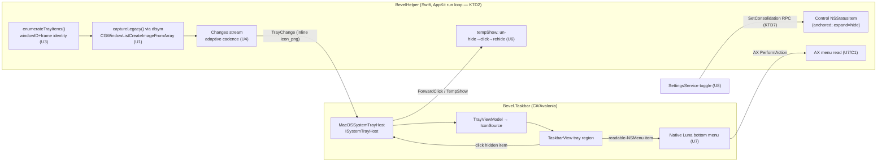
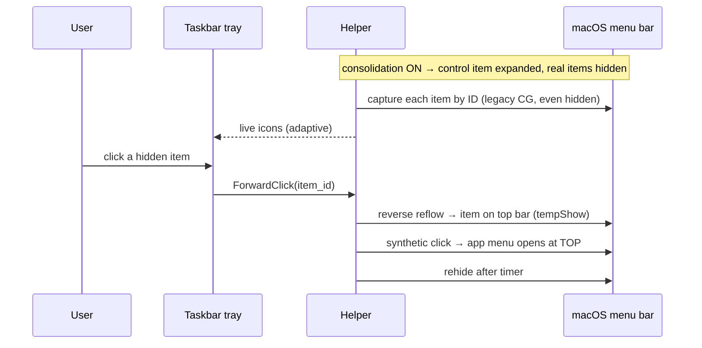

# feat: Menu-bar consolidation into Bevel's tray (Strategy C)

Consolidate the crowded macOS menu bar into Bevel's own bottom taskbar tray: hide the real status
items from the menu bar, render them as **real, live, clickable** icons in the tray, and interact on
click. Every load-bearing mechanism was proven live on macOS 26.5 during the brainstorm (five spike
PoCs under `native/helper-macos/menubar-*-poc.swift`); this plan turns those proofs into the shipping
pipeline. **Scope: full C** — A (hide) + F3 (live capture) + C2 (reveal-at-top) + C1 (native-bottom menu).

---

## Problem Frame

Bevel already mirrors menu-bar extras into its taskbar tray, but the icons render as **placeholders**:
`native/helper-macos/Sources/BevelHelper/TrayServiceImpl.swift` captures each item per-window via
ScreenCaptureKit keyed on the SCK-visible `windowID`. An item that is off-screen (or that SCK simply
won't stream) misses the `byWindowID` map (`TrayServiceImpl.swift:393`) and silently keeps the
limited-mode app icon. There is **no legacy fallback**. The menu bar is never actually decluttered —
Bevel only *copies* it, badly.

Strategy C fixes both halves: **hide** the real items (freeing the crowded bar) and **capture them for
real** (including while hidden), so the tray becomes the single, Windows-style system tray. True
bottom-native menus are impossible (C3 — moving another process's status window — is proven dead: the
WindowServer no-ops cross-connection moves), so clicks **reveal at the top**, mirroring Ice.

---

## Requirements Traceability

Carried from the origin requirements doc (`see origin: docs/brainstorms/2026-08-10-menubar-tray-strategy-c-requirements.md`):

- **R1 — Real icons.** Tray shows real (non-placeholder) icons for all menu-bar extras. → U1
- **R2 — Live updates.** Icons update live (battery %, spinners) with no perceptible staleness while the
  tray is visible; staleness is a bug. → U4
- **R3 — Decluttered bar.** The real menu bar is hidden/collapsed, our control item stable + clickable. → U2
- **R4 — Clickable.** Clicking a tray icon reaches the real item's menu/popover. → U6 (C2), U7 (C1)
- **R5 — Tahoe identity.** Identify items without relying on owner PID (all "Control Centre"). → U3
- **R6 — Opt-in.** A setting consolidates the bar into the tray; off = today's behavior. → U8

**Proven prerequisites (no longer open):** capture-while-hidden works via legacy CG (U1); the hide/anchor
mechanism works (U2); C3 is dead (reveal-at-top is the click model, not relocation).

---

## Key Technical Decisions

- **KTD1 — Capture via `CGWindowListCreateImageFromArray` (dlsym), not ScreenCaptureKit.** SCK returns
  `-3811` the instant a window leaves all displays (proven 0/16 off-screen vs 4/4 for the CG path). On
  macOS 26 the symbol is `unavailable` and even Ice's protocol-conformance trick is now a hard compile
  error, so the C symbol is reached via `dlsym` + a `@convention(c)` typealias. This replaces the SCK
  path for tray capture. *(Ice corroborates in its own source comment.)*
- **KTD2 — The helper runs an AppKit main run loop.** Today `BevelHelper.swift:140` blocks `main` on
  `server.serve()`; there is no `NSApp.run()`/`RunApplicationEventLoop`. A control `NSStatusItem`
  (Strategy A) and status-item event handling need a pumped AppKit loop. Decision: run AppKit on the
  main thread and start the gRPC server in a detached `Task` before entering the loop. *(Alternative — a
  bare `CFRunLoop` pump — rejected as fragile; see Alternatives.)*
- **KTD3 — Hide via anchored control-item expansion.** Create our own `NSStatusItem`, seed
  `"NSStatusItem Preferred Position <name>"` in `UserDefaults` **before** creation + set `autosaveName`,
  and toggle `length` between standard and `10_000` to collapse/reveal (Ice's exact model). Proven live.
  Moving real items to the bottom (C3) is impossible and is **not** attempted.
- **KTD4 — Identity by windowID + frame, not PID.** On macOS 26 every item (ours included) is owned by
  the Control Centre process, so `item_id = "pid:windowNumber"` can't distinguish apps or exclude our
  own control item. Keep the existing `kCGWindowName` + AX-title resolution; add windowID-based
  self-exclusion and frame tracking. `NSWindow.windowNumber` can be negative — never feed it to
  `CGWindowID(_:)` (traps); derive IDs from `CGWindowList`.
- **KTD5 — Tray pixels stay inline protobuf `bytes` (adaptive-throttled) for v1.** `MmfBgraPool` is
  single-writer app-icon storage; a multi-writer tray ring is real work. Keep `TrayItem.icon_png`
  inline, gated by change-detection + adaptive cadence (U4). Revisit only if CPU/message churn proves it.
- **KTD6 — Reveal-at-top (C2) mirrors Ice's `tempShowItem`.** On click of a hidden item: temporarily
  un-hide it back onto the top bar (reverse the reflow), synthetic-click it via the existing
  `pressViaAX`/`clickViaCGEvent`, let the app's menu open at the top, rehide on a timer. The menu opening
  at the top is unavoidable (C3 dead) and is softened with a designed "lift" motion in the tray.
- **KTD7 — Settings reach the helper via a new control RPC, not env.** There is no settings→helper
  channel today (helper takes only `--socket`/`--parent-pid`/token). A live RPC lets consolidation toggle
  without a helper restart. Wire the already-stubbed `MacOSSystemTrayHost.SetNativeTrayHiddenAsync`
  (`src/Bevel.Pal.MacOS/MacOSSystemTrayHost.cs:76`, "arrives in M3-F") to it.

---

## High-Level Technical Design

Pipeline (helper ⇄ taskbar) and the hide/reveal control flow. Authoritative alongside the prose.

---

## Implementation Units

Grouped into four phases; dependency-ordered. U-IDs are stable.

### Phase 1 — Helper foundation

### U1. Legacy CG capture path (F3 core)

- **Goal:** Capture every tray item's window by ID via `CGWindowListCreateImageFromArray` (dlsym),
  replacing the SCK per-item path so off-screen/hidden items return real pixels instead of placeholders.
- **Requirements:** R1. Advances R2.
- **Dependencies:** none.
- **Files:** `native/helper-macos/Sources/BevelHelper/TrayServiceImpl.swift` (replace `captureWindow`/the
  `enumerateWithCapture` capture step), new `native/helper-macos/Sources/BevelHelper/LegacyWindowCapture.swift`
  (the dlsym'd symbol + CGImage→PNG). Port from proven `native/helper-macos/menubar-capture-poc.swift`.
- **Approach:** dlsym `CGWindowListCreateImageFromArray` into a `@convention(c)` typealias (KTD1); build a
  1-element `CFArray` of the windowID; option `[.boundsIgnoreFraming, .bestResolution]`;
  `takeRetainedValue()`. Keep the existing `pngFromCGImage`/`trayGlyphLayout` normalization. Drop the SCK
  `byWindowID` gate (`TrayServiceImpl.swift:393`) — the CG path does not need the window on-screen. Keep
  SCK only as an optional fast path for on-screen items if measured faster (decision deferred to U4).
- **Patterns to follow:** `menubar-capture-poc.swift` `captureLegacy`; existing `pngFromCGImage` (line 426).
- **Test scenarios:**
  - Covers R1. A visible third-party item captures non-empty PNG with expected non-transparent pixel count.
  - A hidden/off-screen item (windowID stable, off all displays) still captures a non-empty PNG (the
    proven case; **runtime-validated** — the CG path can't be exercised headless).
  - `dlsym` returns non-nil for the symbol on the target OS; capture returns nil gracefully (logs, keeps
    last-good) if the symbol is ever absent.
  - Pure: PNG normalization/trim logic on a synthetic CGImage (unit-testable in isolation).
- **Verification:** On a live consolidated bar, every tray item shows its real glyph (no app-icon
  placeholders), including items pushed fully off-screen by the hide.

### U2. Helper AppKit run loop + anchored control item (Strategy A)

- **Goal:** Give the helper a pumped AppKit run loop and an anchored control `NSStatusItem` whose
  expansion hides the real items and whose collapse reveals them.
- **Requirements:** R3.
- **Dependencies:** none (parallel to U1).
- **Files:** `native/helper-macos/Sources/BevelHelper/BevelHelper.swift` (run-loop restructure), new
  `native/helper-macos/Sources/BevelHelper/MenuBarControlItem.swift` (the control item + hide/reveal).
  Port from `native/helper-macos/menubar-hide-poc.swift`.
- **Approach:** KTD2 — start `GRPCServer.serve()` in a detached `Task`, then run AppKit on the main
  thread (`NSApp.run()`), keeping `.accessory` activation. Create the control item in
  `applicationDidFinishLaunching` (not before the loop): seed `"NSStatusItem Preferred Position <name>"`
  in `UserDefaults` before creation, set `autosaveName`, toggle `length` standard↔`10_000` (KTD3). Expose
  `setHidden(_:)` for U5. Watchdog/TCC prompt ordering preserved.
- **Patterns to follow:** `menubar-hide-poc.swift` (`PocDelegate`, anchor seed, length toggle); existing
  TCC/watchdog setup in `BevelHelper.swift:100-140`.
- **Test scenarios:**
  - **Runtime-validated** (AppKit/status-item behavior isn't headless-testable): control item appears
    anchored and stable; expand hides neighbours; collapse reveals; gRPC still serves during the loop.
  - Pure: hide-state transition logic (a small state type) unit-tested for expand/collapse/no-op.
  - Regression: the helper still answers `Ping`/`ListTrayItems` with AppKit on main (no deadlock).
- **Execution note:** Land the run-loop restructure behind a fast `Ping` smoke check before layering the
  control item — a blocked run loop would silently break every RPC.
- **Verification:** Helper boots, control item visible, `bevelctl`/taskbar RPCs still respond; toggling
  hidden collapses/reveals the real bar live.

### U3. Tahoe identity hardening + bounds-on-move

- **Goal:** Identify items robustly on macOS 26 (all owned by Control Centre), exclude our own control
  item(s), and stream current frames so reveal-at-top has live bounds.
- **Requirements:** R5. Supports R4.
- **Dependencies:** U2 (needs the control item's windowID to self-exclude).
- **Files:** `native/helper-macos/Sources/BevelHelper/TrayServiceImpl.swift` (`enumerateTrayItems`,
  `signature`), `proto/bevel.helper.v1.proto` (ensure `bounds` participates in change detection).
- **Approach:** Keep `kCGWindowName` + AX-title resolution. Add windowID-based self-exclusion (never our
  control item). Track frame per item across reflows. Change `signature()` (`TrayServiceImpl.swift:521`)
  to include `bounds` **only** for the reveal path so a moved item emits an UPDATE the client can use —
  guard against icon-churn spam by keeping icon bytes out of the signature. Confirm windowID stability
  across Space changes; deny-list unchanged.
- **Patterns to follow:** existing `resolveItem` (line 603), `axTitle(at:)` (254), `signature` (521),
  `isDenied` (44).
- **Test scenarios:**
  - Covers R5. Two distinct items on a Control-Centre-owned bar get distinct `item_id`s from
    name/AX-title resolution (fixture-driven where the resolver is pure).
  - Our own control item is never emitted as a tray item (self-exclusion by windowID).
  - `signature` emits UPDATE when bounds change but NOT when only icon pixels change (guards the 2s spam).
  - Negative `windowNumber` never reaches `CGWindowID(_:)` (no trap).
- **Verification:** On a live bar, all real extras appear once each, our control item is absent, and
  moving an item produces a bounds UPDATE without icon spam.

### Phase 2 — Live freshness + hide wiring

### U4. Adaptive freshness

- **Goal:** Replace the fixed 2s poll with event-driven + adaptive capture so hidden icons stay live
  without runaway CPU.
- **Requirements:** R2.
- **Dependencies:** U1 (capture), U3 (identity).
- **Files:** `native/helper-macos/Sources/BevelHelper/TrayServiceImpl.swift` (`Changes` loop, lines ~105).
- **Approach:** Keep inline-bytes transport (KTD5). Baseline: capture on structural change
  (add/remove/move via enumerate diff). Layer a higher-rate refresh while consolidation is on and the
  tray is relevant (a cadence field settable via the control RPC from U5). Diff captured PNGs to suppress
  no-op UPDATEs (extend `signature`/a pixel-hash so identical frames don't stream). Cap concurrency of
  per-item CG captures.
- **Patterns to follow:** existing `Changes` server-stream + `Task.sleep` diff loop; `signature` gating.
- **Test scenarios:**
  - Covers R2. A changed icon (different pixel hash) emits UPDATE; an unchanged one does not.
  - Structural add/remove emits ADDED/REMOVED promptly (diff-driven, not only on the slow tick).
  - Cadence backs off when consolidation is off / tray hidden (pure cadence-selection logic unit-tested).
- **Verification:** Battery %/spinner-style items visibly tick in the tray while consolidated; CPU stays
  modest at idle (manual measure noted in Open Questions).

### U5. Hide/reveal control RPC + wire `SetNativeTrayHiddenAsync`

- **Goal:** A gRPC control surface to hide/reveal the section and set cadence, consumed by the C# host.
- **Requirements:** R3, R6.
- **Dependencies:** U2 (control item), U4 (cadence).
- **Files:** `proto/bevel.helper.v1.proto` (new `SetConsolidation`/`SetHidden` RPC + message),
  `native/helper-macos/Sources/BevelHelper/TrayServiceImpl.swift` (handler → `MenuBarControlItem.setHidden`),
  `src/Bevel.Pal.MacOS/MacOSSystemTrayHost.cs` (implement `SetNativeTrayHiddenAsync`, currently a no-op at
  line 76), `src/Bevel.Pal.Abstractions/Interfaces.cs` (confirm the `ISystemTrayHost` signature).
- **Approach:** KTD7 — add a `SetConsolidation(enabled, cadence)` RPC; helper toggles the control item's
  hidden state + cadence. Regenerate stubs both sides. Implement the C# no-op to call it (with the
  existing auth metadata + deadline pattern from `MacOSSystemTrayHost`).
- **Patterns to follow:** `MacOSSystemTrayHost.ForwardClickAsync` (line 79, deadline + auth); proto
  `ForwardClick` shape; `AuthInterceptor` capability `"tray"`.
- **Test scenarios:**
  - Covers R3/R6. `SetNativeTrayHiddenAsync(true)` sends the RPC with correct auth + a bounded deadline
    (C#-side unit test against a fake channel).
  - Helper handler maps enabled→control-item hidden state (pure mapping test).
  - Idempotent: repeated enable/disable doesn't thrash (no-op when already in state).
- **Verification:** Calling the host method live collapses/reveals the real bar within a frame.

### Phase 3 — Interaction

### U6. C2 reveal-at-top click

- **Goal:** Clicking a hidden item in the bottom tray reveals the real item at the top and opens its menu
  there, then rehides — Ice's `tempShowItem`.
- **Requirements:** R4.
- **Dependencies:** U2, U3, U5.
- **Files:** `native/helper-macos/Sources/BevelHelper/TrayServiceImpl.swift` (extend `forwardClick` or add
  `TempShowAndClick`), `proto/bevel.helper.v1.proto` (optional `TempShow` RPC), `src/Bevel.Taskbar/Model/TrayViewModel.cs`
  (`Forward` routes hidden items to the reveal path).
- **Approach:** KTD6 — when the target is hidden, reverse the reflow to bring it on-screen at a computed
  top-bar slot, then synthetic-click via the existing `pressViaAX` (line 220) / `clickViaCGEvent` (270);
  rehide on a timer. Reuse the modifier/button mapping already in `ForwardClickRequest`. Add a tray "lift"
  micro-motion (Avalonia) so the top-jump reads as intentional.
- **Patterns to follow:** Ice `tempShowItem`/`click` (studied); existing `forwardClick`/`pressViaAX`;
  `TrayViewModel.Forward` (line 101) + `OnTrayIconPressed` (`TaskbarView.axaml.cs:505`).
- **Test scenarios:**
  - Covers R4. A hidden item click triggers reveal→click→rehide (sequence orchestration; **runtime-validated**).
  - A visible (non-hidden) item click still forwards directly (no reveal), preserving today's behavior.
  - Rehide timer fires and restores hidden state even if the menu is dismissed early.
  - Pure: top-bar slot computation from live bounds (unit-tested).
- **Verification:** Live — clicking a consolidated icon opens the owning app's real menu (at the top),
  and the item returns to hidden after.

### U7. C1 native-bottom menu for the readable subset

- **Goal:** For items whose menu is a readable `NSMenu`, present a native Bevel (Luna) context menu at the
  bottom and forward selection via AX; fall back to C2 for the rest.
- **Requirements:** R4.
- **Dependencies:** U6 (fallback path).
- **Files:** new `native/helper-macos/Sources/BevelHelper/AxMenuReader.swift` (read a status item's AX
  menu tree), `proto/bevel.helper.v1.proto` (`ReadItemMenu` + `InvokeMenuItem` RPCs), new
  `src/Bevel.Taskbar/Components/TrayItemContextMenu.cs` (build a Luna-styled menu from the tree),
  `src/Bevel.Taskbar/Model/TrayViewModel.cs` (route readable items here).
- **Approach:** Detect a readable `NSMenu` via AX (`AXMenu` child) without opening it where possible; read
  titles/enabled/submenu structure into a serializable tree; render it bottom-anchored in Bevel's theme;
  on selection, AX `PerformAction` the corresponding element. If AX can't read the menu without opening
  it, classify the item as non-proxiable and fall back to U6. Keep the subset detection conservative.
- **Patterns to follow:** existing AX usage (`axTitle`, `pressViaAX`); Luna context-menu theming in
  `src/Bevel.UI`/`Bevel.Themes.Blue2001`; the `ISystemTrayHost` async pattern.
- **Test scenarios:**
  - Covers R4. A readable-menu item renders a bottom menu whose entries match the AX tree (tree→menu
    mapping unit-tested from a fixture tree).
  - Selecting an entry issues the correct AX `PerformAction` (host-side unit test against a fake).
  - A non-readable item falls back to C2 reveal-at-top (routing test).
  - Disabled/submenu entries render correctly (enabled state, nesting).
- **Verification:** Live — a known readable-menu extra opens a Bevel-styled menu at the bottom and its
  actions work; a popover-only extra falls back to reveal-at-top.

### Phase 4 — Integration

### U8. Settings toggle + end-to-end integration

- **Goal:** A "consolidate menu bar into tray" setting that wires hide + live capture + reveal on/off,
  retires the placeholder fallback when on, and keeps CODEMAP/site honest.
- **Requirements:** R6 (and closes R1–R5 end-to-end).
- **Dependencies:** U1–U7.
- **Files:** `src/Bevel.Core/SettingsService.cs` (new `bool` on `BevelSettings` + `ApplyRaw`/`SerializeRaw`),
  `src/Bevel.App/App.axaml.cs` & `src/Bevel.App/Program.cs` (apply on the 750ms `Changed` pathway; the two
  `StartPollAsync` sites at `App.axaml.cs:289-290` / `Program.cs:129-130`), `src/Bevel.Taskbar/TaskbarView.axaml.cs`
  (apply via `Tray.Configure`/new hook), `src/Bevel.Taskbar/OnboardingWindow.axaml.cs` (UI control),
  `CODEMAP.md`, `site/index.html` + `site/shots/`.
- **Approach:** Add the toggle to the settings blob (forward-compatible, no migration). On `Changed`, call
  `SetNativeTrayHiddenAsync` (U5) and switch the tray between mirror-mode (today) and consolidated-mode.
  When consolidated, suppress the limited-mode app-icon fallback (icons now come from U1). Update the two
  composition roots consistently. Re-harvest the tray screenshot into `site/shots/` from a Render* test;
  update CODEMAP per its checklist.
- **Patterns to follow:** existing tray knobs `TaskbarTrayOverflowCap`/`TaskbarTrayIconSize`
  (`SettingsService.cs:630/633`); `ReloadIfChangedAsync`→`Changed` (line 177); onboarding sliders
  (`OnboardingWindow.axaml.cs:180`).
- **Test scenarios:**
  - Covers R6. Toggle round-trips through the settings blob (serialize/deserialize unit test).
  - Enabling calls `SetNativeTrayHiddenAsync(true)` and flips the tray to consolidated mode (host + VM test).
  - Disabling restores today's mirror behavior and reveals the bar (no orphaned hidden items).
  - Both composition roots apply the toggle identically (no drift between `App` and `Program`).
- **Verification:** Toggling the setting live consolidates/de-consolidates the bar end-to-end; default
  (off) is byte-for-byte today's behavior; CODEMAP + site reflect the feature.

---

## Scope Boundaries

**In scope (full C):** A (U2), F3 (U1/U4), C2 (U6), C1 (U7), identity (U3), control surface (U5),
settings + integration (U8).

### Deferred to Follow-Up Work

- **Shared-memory tray pixel transport.** Inline protobuf bytes (KTD5) ship first; a multi-writer tray
  ring (vs `MmfBgraPool`'s single-writer app-icon design) only if U4's CPU/churn measurement demands it.
- **Multi-display / notch nuance for hide placement** beyond the primary display — Ice invests heavily
  here; land single-display correctness first.
- **Drag-to-reorder / sections (always-hidden)** — Ice-style richer management is out of v1.
- **Windows/Flat theme parity** for the C1 bottom menu — Luna first.

### Outside this product's identity

- Moving real items to the bottom / true bottom-native menus (C3 — proven impossible).
- A separate floating "Ice Bar" panel — Bevel's surface is its own bottom tray, not a top panel.

---

## Risks & Mitigations

- **Helper run-loop restructure (KTD2) is invasive** — a blocked loop breaks every RPC. *Mitigate:* land
  U2 behind a `Ping` smoke test; gRPC on a detached Task, AppKit on main; keep the change isolated.
- **Undocumented, version-fragile Tahoe menu-bar internals** (Control-Centre hosting, reflow behavior).
  *Mitigate:* identity by windowID+frame (U3), live validation, the existing deny-list + `BEVEL_TRAY_DISABLE`.
- **`CGWindowListCreateImageFromArray` is `unavailable`/deprecated** — a future macOS could remove it.
  *Mitigate:* isolate behind one dlsym'd function (U1); keep SCK as the on-screen fallback; fail to
  last-good icon, never crash.
- **Freshness CPU cost** of capturing many hidden items. *Mitigate:* adaptive cadence + pixel-diff
  suppression (U4); capture only when consolidated.
- **C1 subset may be small** (few apps expose a readable `NSMenu` without opening). *Mitigate:* C2
  fallback is always present; detection stays conservative; measure real coverage (Open Questions).
- **Reveal-at-top menu opens at the top** (unavoidable, C3 dead). *Mitigate:* designed "lift" motion;
  documented as expected behavior.

---

## Open Questions (execution-time)

- Freshness cadence: what idle/active rates keep icons live without material CPU? (Measure in U4.)
- Window-ID stability across Space switches and display reconfiguration — verify during U3/U6.
- C1's real readable-`NSMenu` coverage on a representative bar — quantify during U7.
- Whether SCK is worth keeping as an on-screen fast path or the CG path alone suffices (decide in U4).

---

## System-Wide Impact

- **Helper process shape changes** (AppKit run loop) — affects everyone who links the helper; smoke-test
  all three services (`supervision`, `window`, `tray`) after U2.
- **New proto RPCs/messages** — regenerate Swift + C# stubs; `proto/bevel.helper.v1.proto` is the single
  contract (`csharp_namespace = "Bevel.Ipc.V1"`).
- **Two composition roots** (`App.axaml.cs`, `Program.cs`) both start tray polling — keep the toggle
  wiring in sync (U8).
- **Settings blob** gains one forward-compatible field — no migration; peer processes pick it up via the
  750ms poll.

---

## Sources & Research

- Origin requirements: `docs/brainstorms/2026-08-10-menubar-tray-strategy-c-requirements.md`.
- Design teardown + live frame data: `docs/design/menubar-management.md`.
- Proven spikes: `native/helper-macos/menubar-hide-poc.swift` (A), `menubar-capture-poc.swift` (F3, incl.
  the legacy-CG resolution), `menubar-c3-move-poc.swift` + `menubar-c3-retry-poc.swift` (C3 dead).
- Ice (`jordanbaird/Ice`, MIT) — read directly for `ControlItem`, `MenuBarSection`, `MenuBarItemImageCache`
  (`CGWindowListCreateImageFromArray`), `MenuBarItemManager.tempShowItem`, and the top-anchored panel.
- Repo pipeline map (this session's research): `TrayServiceImpl.swift`, `proto/bevel.helper.v1.proto`,
  `MacOSSystemTrayHost.cs`, `TrayViewModel.cs`/`TrayIconTint.cs`, `HelperProcessHost.cs`,
  `SettingsService.cs`, `MmfBgraPool.cs`.
