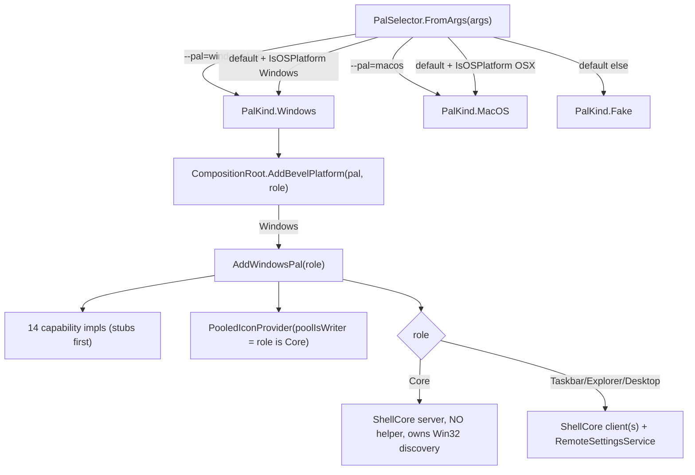
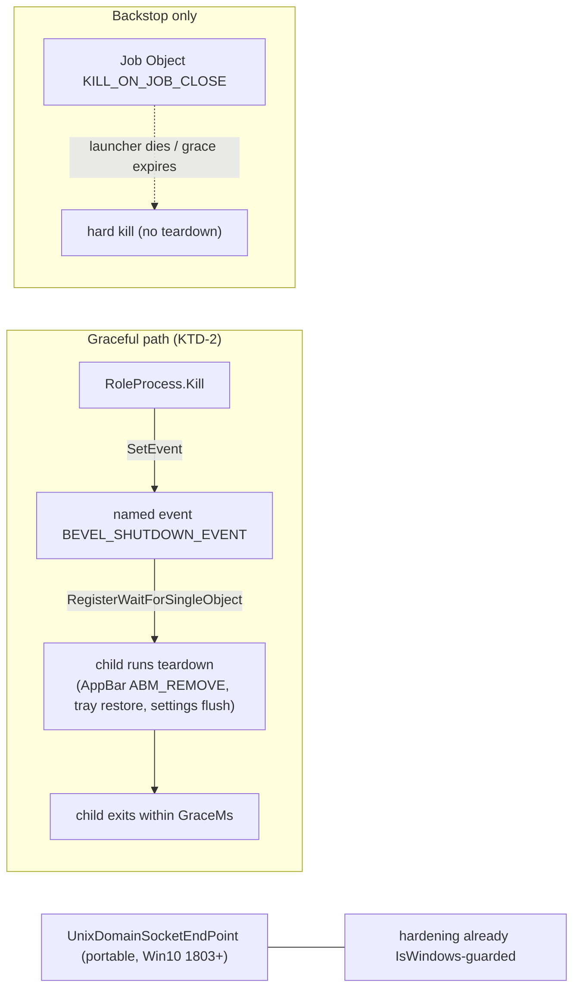
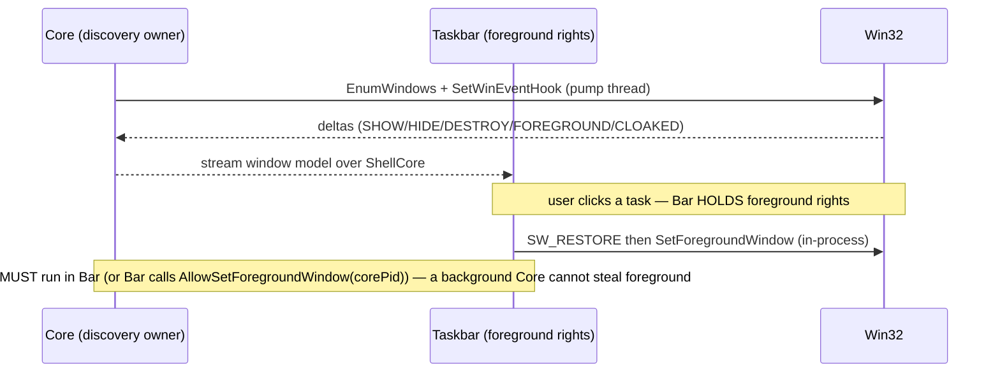

# feat: Port Bevel to Windows (`Bevel.Pal.Windows`) for full-functionality deploy

> **Deepened 2026-09-08 with Fable 5.1** against the live codebase (corrected the teardown mechanism, foreground ownership, WinEvent model, per-monitor DPI, the `IDesktopEnvironment`/wallpaper surface, and COM threading; U-IDs now 1:1 with `bevel-ncfp.<n>`), then **hardened with three parallel framework-docs research passes** (process-lifecycle/IPC, window-management, shell-integration) — every load-bearing Win32 API is now pinned with a `learn.microsoft.com` citation in **Appendix A**.

## Summary

Bevel is designed as a cross-platform desktop shell but ships only two PALs: `Bevel.Pal.Fake` (in-memory demo/UI-test) and `Bevel.Pal.MacOS`. On Windows the app boots the **Fake PAL** — themed chrome, no real OS integration. "Full functionality on Windows" therefore means **building a Windows PAL** plus bringing the split multi-process launcher and its Unix-domain-socket (UDS) IPC up on Windows, then packaging a `win-x64` build and deploying it to the LAN box (`NUCBOX_EVO-X2`, `192.168.1.48`, SMB — RDP off).

Twelve implementation units, **U1–U12 mapping 1:1 to `bevel-ncfp.1`–`.12`**. Critical path: **U1 bootstrap → U11-minimal (publish+deploy floor) → U2 launcher/IPC → U3 window manager**, after which an early real build is usable. Two units are **time-boxed spikes** with defined fallbacks: U4 (tray — the notification area is explorer-owned) and U5 (set-as-shell — can lock a user out).

## Problem Frame

- **Current state:** `PalSelector.FromArgs` (`src/Bevel.App/PalSelection.cs`) defaults to `PalKind.MacOS` on macOS, `PalKind.Fake` elsewhere. `PalKind` has two members. `CompositionRoot.AddBevelPlatform` (`src/Bevel.App/CompositionRoot.cs`) falls back to `AddFakePal` for non-macOS. No `Bevel.Pal.Windows`; no Win32 integration anywhere in `src/`.
- **The split is macOS-shaped but less so than v1 assumed.** Deepening found the socket-dir hardening call-sites are *already* `OperatingSystem.IsWindows()`-guarded (`UdsMessageServer.Start` src/Bevel.ShellCore.Ipc/UdsMessageServer.cs:76; `ShellCoreEndpoint.Harden`; `LauncherControl.CreateServerEndpoint` no-op `SetUnixFileMode` on Windows), and the transport is a portable stream socket with delete-before-bind. What is **not** portable: graceful process teardown (SIGTERM path returns `false` on Windows today — `RoleProcess.TrySigterm` at src/Bevel.App/Supervision/RoleProcess.cs:63 — so `Kill()` goes straight to hard tree-kill, skipping every child's teardown), per-monitor DPI awareness for the headless core, and the console-subsystem `OutputType`.
- **No single-process mode** (`role=all` removed, bevel-dwhy) — the split must work on Windows for the app to function at all.
- **Goal:** a `win-x64` build that boots the split launcher on Windows and mirrors the user's real windows (and, if the spikes land, the tray), deployable to `NUCBOX_EVO-X2`.

## Requirements

| R-ID | Requirement | Advanced by |
|------|-------------|-------------|
| R1 | `--pal=windows` selects a real Windows PAL; the selector defaults to it on Windows | U1 |
| R2 | The split launcher (core + taskbar + explorer) boots, communicates, and tears down gracefully on Windows | U2 |
| R3 | The taskbar mirrors real top-level windows with live add/remove/foreground/minimize and supports activate/restore/minimize/close/reposition/capture/terminate | U3 |
| R4 | Running apps and installed apps are enumerated and launchable; app icons resolve | U6 |
| R5 | The taskbar reserves work-area (maximized windows don't cover it) and can hide/restore the native tray; monitor changes are observed | U7 |
| R6 | Explorer performs real file operations (copy/move/recycle/rename), opens files/verbs, reads volume labels, shows real per-file icons | U8 |
| R7 | A `win-x64` self-contained build is packaged and deployable to `NUCBOX_EVO-X2` over SMB | U11 |
| R8 | The Windows notification area is mirrored, or a scoped fallback is chosen | U4 (spike) |
| R9 | Bevel can register as the Windows shell, run at login, and drive logout/shutdown — reversibly | U5 (spike) |
| R10 | CI runs a Windows **runtime** smoke test, not just a build | U12 |

## Key Technical Decisions

- **KTD-1 — A dedicated `Bevel.Pal.Windows` project, mirroring the `Bevel.Pal.MacOS` M0 stub pattern.** Not `#if WINDOWS` inside the macOS project (which P/Invokes `libobjc`/`libSystem` and hosts a Swift-helper gRPC client). `AddWindowsPal(role)` mirrors `AddMacOSPal(role)` in `CompositionRoot`, **minus the helper** (Windows has no helper), and **including** the `PooledIconProvider` decorator with `poolIsWriter = role is Core` (see KTD-7).
- **KTD-2 — Reuse the UDS transport; graceful teardown is an explicit handshake, not a signal.** `UnixDomainSocketEndPoint` is portable (Win10 1803+) and the hardening branch already exists Windows-guarded. But no OS signal reaches a headless child on Windows: `WM_CLOSE` needs a window/pump the core doesn't have; `CTRL_CLOSE_EVENT` can't be generated programmatically; `PosixSignalRegistration(SIGTERM)` maps only to OS-shutdown. So teardown is a **named kernel event**: the launcher passes each child `BEVEL_SHUTDOWN_EVENT=<name>` (mirroring the existing `BEVEL_LAUNCHER_SOCKET` env), the child `RegisterWaitForSingleObject`s it and runs the same path its SIGTERM handler does; `RoleProcess.Kill` signals it, waits `GraceMs`, then hard-kills. A **Job Object** (`JOB_OBJECT_LIMIT_KILL_ON_JOB_CLOSE` in `JOBOBJECT_EXTENDED_LIMIT_INFORMATION`, P/Invoke — .NET exposes none of it) is the *orphan backstop only*, never the graceful path; prefer create-suspended→assign→resume to close the fast-child race, and handle the **already-in-a-job** case (CI runners / Windows Terminal nest by default on Win8+). The named event is the managed `EventWaitHandle(ManualReset, name)` (a cross-process `CreateEvent`/`OpenEvent`); the child waits via `ThreadPool.RegisterWaitForSingleObject`. **.NET 10 caveat:** the runtime no longer installs default `CTRL_CLOSE`/`SIGTERM` handlers, so each role must register its own teardown regardless. Socket dir is a fixed short path under `%LOCALAPPDATA%\bevel\` (**not** `%TEMP%`/`Path.GetTempPath()` as the code currently uses — Storage Sense can purge a live socket file there), on a **local NTFS** volume, delete-before-bind, with a startup guard asserting the socket path's UTF-8 byte length < 108 (`sun_path` limit). The "0700 equivalent" needs **no explicit DACL** — a dir under `%LOCALAPPDATA%` inherits the profile's user-only ACL. See **Appendix A** for the cited API contract.
- **KTD-3 — Window management via `EnumWindows` (initial) + `SetWinEventHook` (deltas) on a dedicated message-pump thread.** In-process (no helper). Correct event set is `EVENT_OBJECT_SHOW/HIDE/DESTROY`, `EVENT_SYSTEM_FOREGROUND`, `EVENT_SYSTEM_MINIMIZESTART/END`, `EVENT_OBJECT_NAMECHANGE`, `EVENT_OBJECT_CLOAKED/UNCLOAKED` — **not** `OBJECT_CREATE` (fires for every accessible object; window has no title/style yet).
- **KTD-4 — Set-as-shell is per-user (`HKCU\...\Winlogon\Shell`), reversible by *deleting* the value, and opt-in.** Never `HKLM`. Restore = delete the HKCU value so Winlogon falls back to the HKLM default `explorer.exe` (not writing `explorer.exe` into HKCU). Document the escape hatch (Ctrl+Alt+Del → Task Manager → Run new task → `explorer`/`regedit`). A `HKLM\...\Policies\System:Shell` value overrides per-user, so `IsRegisteredAsShellAsync` must check it.
- **KTD-5 — Tray mirroring is a spike with a defined fallback.** If cross-process notification-area enumeration proves infeasible in the time-box, v1 ships **own-app tray only**. Mirroring third-party icons may slip past v1.
- **KTD-6 — No code-signing for the initial deploy.** LAN dev target; SmartScreen/unsigned acceptable. Signing deferred.
- **KTD-7 — The Windows PAL owns exactly two long-lived native threads.** (1) a **message-pump thread** hosting the WinEvent hooks *and* a message-only window for `WM_DISPLAYCHANGE`/`WM_DEVICECHANGE`/`TaskbarCreated`; (2) an **STA COM thread** for `IFileOperation`, `IShellLink`, `SHAssocEnumHandlers`, `SHGetFileInfo`, and `HICON`→BGRA icon extraction (all need `CoInitialize`/STA affinity). Every PAL method returns immediately-awaitable Tasks marshaled onto these threads; **nothing touches the Avalonia UI thread** (hard project rule). WinEvent `WINEVENTPROC` and COM callbacks are stored in fields — a GC'd native delegate is a crash.

## High-Level Technical Design

### PAL selection and composition (U1)



### Split launcher + teardown on Windows (U2) — corrected



### Window discovery + foreground ownership (U3, O1)



## Output Structure

```
src/Bevel.Pal.Windows/
├── Bevel.Pal.Windows.csproj          # net10.0; conditional <OutputType>WinExe</OutputType> guidance lives in Bevel.App
├── WindowsPal.cs                     # NotYet stubs (mirror MacOSPal.cs)
├── WindowsWindowManager.cs           # U3
├── WindowsAppEnvironment.cs          # U6
├── WindowsSystemTrayHost.cs          # U4 (spike; own-app fallback)
├── WindowsShellSession.cs            # U5 (spike; per-user set-as-shell)
├── WindowsDesktopEnvironment.cs      # U7 (monitors + reserve work-area; NO wallpaper get/set)
├── WindowsDockController.cs          # U7 (native-tray hide/restore)
├── WindowsFileOperations.cs / FileOpener / VolumeLabelSource / IconProvider   # U8
├── WindowsPermissionBroker.cs / WindowsAudioPlayback.cs                        # U9
├── WindowsTabProvider.cs             # U10 (or defer)
├── Threads/                          # pump thread + STA COM thread (KTD-7)
└── Interop/                          # P/Invoke grouped by DLL (user32, shell32, dwmapi, kernel32)
tests/Bevel.Pal.Windows.Tests/
packaging/windows/                    # U11: publish + deploy-to-box script + app manifest
```

---

## Implementation Units

> U-IDs are 1:1 with `bevel-ncfp.<n>`. Guard **every** P/Invoke entry with `OperatingSystem.IsWindows()` so the assembly loads on CI's macOS/Linux runners without throwing (mirrors the bevel-8kxc fix). Contract parity is checked against `Bevel.Pal.ContractTests`; runtime behavior is smoke-tested on the box.

### U1. Windows PAL bootstrap: project + `AddWindowsPal` + `PalKind.Windows`

- **Goal:** `--pal=windows` wires a real (initially stubbed) Windows PAL; the process boots-or-fails-loudly, DPI-correct, without a stray console window.
- **Requirements:** R1. **Dependencies:** none (gates all).
- **Files:** `src/Bevel.Pal.Windows/Bevel.Pal.Windows.csproj`, `src/Bevel.Pal.Windows/WindowsPal.cs` (NotYet stubs for all 14 interfaces — mirror `src/Bevel.Pal.MacOS/MacOSPal.cs`), `src/Bevel.App/PalSelection.cs` (add `PalKind.Windows`; default under `IsOSPlatform(Windows)`; accept `--pal=windows|win`), `src/Bevel.App/CompositionRoot.cs` (`AddWindowsPal(role)` mirroring `AddMacOSPal` incl. `PooledIconProvider`/`poolIsWriter`), `src/Bevel.App/Bevel.App.csproj` (conditional `<OutputType>WinExe</OutputType>` when the RID targets Windows — the current `Exe` opens a session-long console; F15), `Bevel.sln`, `tests/Bevel.Taskbar.Tests/RoleSelectorTests.cs`.
- **Approach:** copy the `NotYet` idiom. **Per-monitor DPI (F8):** the app manifest (or `SetProcessDpiAwarenessContext(PER_MONITOR_AWARE_V2)` at entry, before any window/monitor API) must apply to **all roles including `--role=core`** — the headless core owns window discovery and would otherwise stream *virtualized* (wrong) bounds on scaled monitors. `AddWindowsPal` registers all 14 impls + the role-aware shell-core wiring (server for Core; client + `RemoteSettingsService` for peers), minus the helper.
- **Patterns to follow:** `MacOSPal.cs`, `AddMacOSPal`/`AddFakePal` in `CompositionRoot.cs`, `Bevel.Pal.MacOS.csproj`.
- **Test scenarios:**
  - `FromArgs(["--pal=windows"])` and `["--pal=win"]` → `PalKind.Windows`.
  - `AddBevelPlatform(Windows, Core)` registers all 14 interfaces, a shell-core **server**, `PooledIconProvider` as writer, and **no** helper hosted service.
  - `AddBevelPlatform(Windows, Taskbar)` registers `RemoteSettingsService` + a keyed `settings` client; `PooledIconProvider` as reader.
  - Solution builds under the CI `WarningsAsErrors` set in Release on win-x64/osx-x64/linux-x64.
- **Verification:** build green on all three RIDs; `--pal=windows --role=core` constructs; double-click launch shows no console window; a scaled-monitor bounds read (once U3 lands) is physical-pixel correct.

### U2. Launcher + UDS IPC + graceful teardown on Windows

- **Goal:** core + taskbar (+ explorer) spawn, talk over UDS, and tear down gracefully — no skipped cleanup, no orphans.
- **Requirements:** R2. **Dependencies:** U1; **U11-minimal** (a bare `dotnet publish -r win-x64` + SMB copy script — the on-box spike can't run without it; F4/F18).
- **Files:** `src/Bevel.App/Supervision/RoleProcess.cs` (the Windows `TrySigterm`→hard-kill gap at line 63; add the named-event signal + Job Object assignment), `src/Bevel.App/Supervision/RoleProcessSupervisor.cs`, `src/Bevel.App/Program.cs` (child registers `RegisterWaitForSingleObject` on `BEVEL_SHUTDOWN_EVENT` → same path as the SIGTERM handler at lines ~254), `src/Bevel.App/ShellCore/ShellCoreEndpoint.cs` + `LauncherControl` + icon-pool path (move socket dir off `Path.GetTempPath()` to `%LOCALAPPDATA%\bevel` on Windows; add the <108-byte guard).
- **Approach:** spike on the box first (KTD-2). The hardening branch already exists — U2's job is the **teardown handshake**, the **socket-dir choice + length guard**, and the **Job Object backstop**, not "adding a Windows hardening branch."
- **Execution note:** runtime spike proving the socket handshake + a settings round-trip on the box *before* writing the teardown/ACL code — the real unknowns live here.
- **Test scenarios:**
  - Child receives the shutdown event → runs teardown → exits within `GraceMs`; event never signaled + launcher dies → Job Object closes the child (no orphan).
  - Nonce handshake succeeds over UDS **on Windows CI** (the existing test runs on macOS today — F17); a wrong nonce is rejected.
  - `kill -9` the core, restart → stale reparse-point socket deleted, rebind succeeds; token file written by core is readable by a peer process on Windows (F9).
  - Startup guard fails loudly when the socket path exceeds 108 UTF-8 bytes.
- **Verification:** argument-less launch brings up core+taskbar on the box; settings propagate; quitting runs child teardown then exits with no orphaned `Bevel.App.exe`.

### U3. `IWindowManager` (Win32): enumerate + live events + full action surface

- **Goal:** the taskbar mirrors real windows with live deltas; all `IWindowManager` members work, DPI-correct.
- **Requirements:** R3. **Dependencies:** U1 (build), U2 (run in split). **Soft:** O1 verdict.
- **Files:** `src/Bevel.Pal.Windows/WindowsWindowManager.cs`, `src/Bevel.Pal.Windows/Threads/WinEventPump.cs`, `src/Bevel.Pal.Windows/Interop/User32.cs`, `Dwmapi.cs`, `tests/Bevel.Pal.Windows.Tests/WindowsWindowManagerTests.cs`.
- **Approach:** `EnumWindows` initial set; filter to real top-level app windows (skip `WS_EX_TOOLWINDOW`, invisible, owned, and `DWMWA_CLOAKED` UWP/virtual-desktop windows). `SetWinEventHook` (out-of-context) on a **dedicated pump thread** running `GetMessage` (KTD-3/KTD-7); `WINEVENTPROC` stored in a field; callbacks filter `idObject==OBJID_WINDOW && idChild==CHILDID_SELF`. Raise `WindowOpened/Closed/Changed/ForegroundChanged` (parity with `MacOSWindowManager`). **The full contract (src/Bevel.Pal.Abstractions/Interfaces.cs:9) the plan must cover (F10):** `CaptureWindowAsync` → `PrintWindow(hwnd, hdc, PW_RENDERFULLCONTENT)` encoded to PNG off-thread (DWM thumbnails can't be read back as bytes); `RestoreAndActivateAsync` → `SW_RESTORE` **then** `SetForegroundWindow` atomically (bevel-nxic exists because sequencing races animations); `TerminateAppAsync(id, force)` → graceful `WM_CLOSE` fan-out, force = `TerminateProcess`. **Foreground (F2):** a background Core cannot `SetForegroundWindow`; activation runs in the **taskbar** process, or the taskbar calls `AllowSetForegroundWindow(corePid)` immediately before a forwarded activate. No `AttachThreadInput` tricks. **UWP (F11):** windows belong to `ApplicationFrameHost.exe`; resolve the hosted app via `GetApplicationUserModelId` on the inner `CoreWindow` child, not the AFH PID.
- **Patterns to follow:** `src/Bevel.Pal.MacOS/MacOSWindowManager.cs` (event surface, "discovery authority, don't re-poll").
- **Test scenarios:**
  - Enumerate returns visible top-level windows; excludes tool/owned/cloaked windows.
  - Launch Notepad → `WindowOpened`; close → `WindowClosed`; alt-tab → `ForegroundChanged`; minimize → minimize transition.
  - Launch Calculator (UWP) → exactly one entry, correct name+icon, **not** attributed to ApplicationFrameHost (F11).
  - `ActivateAsync` from the taskbar foregrounds a background window; `RestoreAndActivateAsync` un-minimizes and raises atomically; `CaptureWindowAsync` returns non-empty PNG bytes; `TerminateAppAsync(force:false)` closes windows, `force:true` kills.
  - On a >100% scaled monitor, enumerate bounds == actual pixel bounds; `RepositionAsync` round-trips (F8).
  - Pump-thread health: the `WINEVENTPROC` survives a Gen2 GC; if the pump thread dies, a supervisor/health assertion fires (events must not stop silently — F17).
- **Verification:** on the box the taskbar shows real windows, updates live, and clicking a task activates/minimizes it.

### U4. `ISystemTrayHost` (notification area) — HIGH-RISK spike

- **Goal:** decide and implement how (or whether) Bevel mirrors the Windows notification area for v1.
- **Requirements:** R8. **Dependencies:** U1. **Gate:** option (a) below is gated on "no explorer taskbar running", **not** on U5 (F13/F18).
- **Files:** `src/Bevel.Pal.Windows/WindowsSystemTrayHost.cs`, spike notes on the bead.
- **Approach (2–3d spike, must run on the NUCBOX's actual Windows 11 build — Win10 recipes may not survive it):**
  - (a) Own the `Shell_TrayWnd` class name (register first after a `TaskbarCreated` broadcast) and receive `Shell_NotifyIcon` traffic directly — precondition is *explorer's taskbar not running* (orthogonal to set-as-shell).
  - (b) Cross-process enumerate `Shell_TrayWnd`→`ToolbarWindow32` via `VirtualAllocEx`+`ReadProcessMemory` of the undocumented `TBBUTTON`/`dwData` layout — Windows-version and bitness sensitive; on **Win11 most icons live in `NotifyIconOverflowWindow`** with **no add/remove events (poll only)**; `ForwardClickAsync` needs the owner-HWND + callback message from that same cross-process memory.
  - (c) **Fallback: own-app tray only** (KTD-5).
- **Also:** `SetNativeTrayHiddenAsync` is undefined for Windows in v1 — semantics: no-op when mirroring is off; hide the native tray area only in shell-replacement mode (F13).
- **Patterns to follow:** `src/Bevel.Pal.MacOS/MacOSSystemTrayHost.cs` (mirrored-tray surface; only discovery differs).
- **Test scenarios:** capability reports chosen mode; if (b), enumerating a known icon yields bounds+PNG (runtime smoke, incl. an overflow icon); if fallback, own status items add/remove/update; `SetNativeTrayHiddenAsync` no-ops when not shell.
- **Verification:** a documented decision + a working tray at the chosen scope; no regression to the macOS tray.

### U5. `IShellSession`: set-as-shell + run-at-login + logout — HIGH-RISK spike

- **Goal:** Bevel can (reversibly) become the Windows shell, run at login, and drive logout/shutdown.
- **Requirements:** R9. **Dependencies:** U1.
- **Files:** `src/Bevel.Pal.Windows/WindowsShellSession.cs`, `packaging/windows/RESTORE-SHELL.md` (escape hatch).
- **Approach:** set-as-shell = `HKCU\Software\Microsoft\Windows NT\CurrentVersion\Winlogon` `Shell` (REG_SZ) — the standard per-user kiosk mechanism (KTD-4). **Restore = delete the HKCU value** (falls back to HKLM `explorer.exe`), never write `explorer.exe` into HKCU. `IsRegisteredAsShellAsync` must also check for a `HKLM\...\Policies\System:Shell` override (managed boxes). Run-at-login via the `Run` key/Startup shortcut (parity with `SMAppService`/`LoginItemRegistrar`). `LogOutAsync` via `ExitWindowsEx` — **`EWX_SHUTDOWN/EWX_REBOOT` first need `SE_SHUTDOWN_NAME` via `AdjustTokenPrivileges`** (logoff needs no privilege). Document the escape hatch (Ctrl+Alt+Del → Task Manager → Run new task → `explorer`/`regedit`) since `.reg` restore is unusable from inside a broken shell.
- **Execution note:** test set-as-shell only in a VM/throwaway account first.
- **Patterns to follow:** `MacOSShellSession`.
- **Test scenarios:**
  - Run-at-login enable/disable writes/removes the Run entry; `IsRunAtLoginEnabledAsync` reflects state.
  - Set-as-shell writes the HKCU value; **unregister deletes it (asserted absent, not `explorer.exe`)**; idempotent.
  - `IsRegisteredAsShellAsync` returns false when a HLKM policy Shell overrides.
  - Shutdown path enables `SE_SHUTDOWN_NAME` (assert token adjustment; mock the final `ExitWindowsEx`); `LogOutAsync(kind)` maps to the right `EWX_*`.
- **Verification:** in a VM account, logout/in launches Bevel as shell; documented restore returns explorer.

### U6. `IAppEnvironment`: running + installed apps, launch/activate, icons

- **Goal:** taskbar app list + Start-menu launch backed by real processes and the installed-apps list.
- **Requirements:** R4. **Dependencies:** U1 (build), U3 (window↔app correlation).
- **Files:** `src/Bevel.Pal.Windows/WindowsAppEnvironment.cs`, `src/Bevel.Pal.Windows/Interop/Shell32.cs`, `tests/Bevel.Pal.Windows.Tests/WindowsAppEnvironmentTests.cs`.
- **Approach:** running apps = processes owning visible top-level windows (correlate with U3's HWND set via `GetWindowThreadProcessId`, with the UWP/AFH resolution from F11); launch/activate via `ShellExecuteEx`/`SetForegroundWindow`; icons via `SHGetFileInfo`/`ExtractIconEx` (on the STA thread, KTD-7). **The contract also requires `EnumerateInstalledAppsAsync` + `InstalledAppsChanged` (F12):** enumerate Start-menu `.lnk` (both `%ProgramData%` and per-user) via `IShellLink` COM, UWP entries via `shell:AppsFolder`, with `FileSystemWatcher`s feeding the change event. **Windows app-identity (O4):** pin what fills `RunningApp`/`bundleId` — exe path or AUMID for packaged apps — consistently with U3's `TerminateAppAsync`.
- **Test scenarios:**
  - Running list contains a launched Notepad; omits windowless services.
  - `LaunchAsync(path)` starts the process; activating a running app foregrounds rather than relaunches.
  - App icon resolves to non-null bitmap for a known .exe and a UWP app.
  - Installing/removing a Start-menu shortcut raises `InstalledAppsChanged` with the delta.
- **Verification:** runtime smoke — Start-menu launch works; the app list matches reality.

### U7. `IDesktopEnvironment` + `IDockController`: monitors, reserve work-area, native-tray hide

- **Goal:** reserve screen space for Bevel's bar and hide/restore the native tray; observe monitor changes. **(No wallpaper get/set — the interface has none; F6.)**
- **Requirements:** R5. **Dependencies:** U1. **Soft:** work-area strategy forks on U5's verdict (F18).
- **Files:** `src/Bevel.Pal.Windows/WindowsDesktopEnvironment.cs`, `src/Bevel.Pal.Windows/WindowsDockController.cs`, `src/Bevel.Pal.Windows/Threads/MessageOnlyWindow.cs`, `Interop/User32.cs` (SPI + AppBar).
- **Approach (corrected against src/Bevel.Pal.Abstractions/Interfaces.cs:77 — the real surface is `GetMonitorsAsync`/`ReserveWorkAreaAsync`/`SetWallpaperVisibleToHostAsync`/`MonitorsChanged`):** work-area reservation is **dual-strategy** — `SHAppBarMessage` (`ABM_NEW/SETPOS/QUERYPOS/REMOVE`) when an explorer shell serves it; **`SystemParametersInfo(SPI_SETWORKAREA)` per-monitor** when Bevel *is* the shell (AppBar has no server then), with **startup reconciliation** (SPI_SETWORKAREA isn't auto-restored after a crash). The Windows `IDockController` analogue is hide/auto-hide-and-restore of the native `Shell_TrayWnd` (symmetric restore on teardown — depends on KTD-2's graceful path existing). `MonitorsChanged` = a message-only window receiving `WM_DISPLAYCHANGE`/`WM_DEVICECHANGE`. `SetWallpaperVisibleToHostAsync` maps to showing/hiding the desktop `WorkerW`/`Progman` layer as needed.
- **Test scenarios:**
  - `GetMonitorsAsync` returns all monitors with correct per-monitor bounds/scale.
  - AppBar reservation excludes the strip from a maximized window's work-area; `ABM_REMOVE` restores it.
  - Shell-mode: `SPI_SETWORKAREA` reserves the strip; **hard-kill with the strip reserved → next boot reconciles the work-area back** (F6).
  - Plugging/unplugging a monitor raises `MonitorsChanged`.
- **Verification:** on the box, maximizing an app leaves Bevel's taskbar visible; native tray hides/restores cleanly.

### U8. File stack: `IFileOperations`/`IFileOpener`/`IVolumeLabelSource`/`IIconProvider`

- **Goal:** Explorer performs real Windows file ops, opens files/verbs, reads volume labels, shows real icons — without blocking the UI thread.
- **Requirements:** R6. **Dependencies:** U1.
- **Files:** `src/Bevel.Pal.Windows/WindowsFileOperations.cs`, `WindowsFileOpener.cs`, `WindowsVolumeLabelSource.cs`, `WindowsIconProvider.cs`, `src/Bevel.Pal.Windows/Interop/Shell32.cs`, `tests/Bevel.Pal.Windows.Tests/WindowsFileOperationsTests.cs`.
- **Approach (F7):** all shell COM — `IFileOperation`, `IShellLink`, `SHAssocEnumHandlers`, `SHGetFileInfo` (needs `CoInitialize` on the calling thread) — runs on the **one dedicated STA thread with a pump** (KTD-7); PAL methods marshal on and return Tasks; **never** the Avalonia UI thread, and **never** a blocking call *on* it. `IFileOperation` preferred over `SHFileOperation` (native progress + undo). **Recycle caveat:** `FOFX_ALLOWUNDO` recycles only on volumes with a Recycle Bin — network shares / some removable drives delete permanently even in `DeleteMode.Recycle`; surface a capability/pre-flight rather than silently permanent-deleting. `IFileOpener.PreviewAsync` (Quick Look) has no Windows analogue — no-op or defer; `GetHandlersAsync` (Open With) = `SHAssocEnumHandlers`.
- **Test scenarios:**
  - Copy/move into a temp dir produces the file; `DeleteMode.Recycle` sends to Recycle Bin (recoverable) vs permanent.
  - **Recycle on a network path surfaces the permanent-delete behavior** (or a capability report) — no silent data loss.
  - A copy conflict with the dialog suppressed doesn't deadlock the STA thread.
  - Rename to an existing name surfaces the expected conflict; volume label reads a known drive; icon resolves for `.txt` and a folder.
- **Verification:** Explorer on the box copies/moves/recycles/renames, opens files, shows correct icons; the UI thread never stalls during a large copy.

### U9. `IPermissionBroker` + `IAudioPlayback`

- **Goal:** the small remaining surfaces so `AddWindowsPal` has no throwing stubs.
- **Requirements:** completeness. **Dependencies:** U1.
- **Files:** `src/Bevel.Pal.Windows/WindowsPermissionBroker.cs`, `src/Bevel.Pal.Windows/WindowsAudioPlayback.cs`.
- **Approach:** permission broker reports granted (no TCC; UAC only where needed); audio via `winmm` `PlaySound(SND_FILENAME|SND_ASYNC)`/`MessageBeep`.
- **Test scenarios:** broker returns granted for all capabilities; `PlayAsync` respects `Muted` (no throw) and maps to `SND_FILENAME|SND_ASYNC`; a missing wav degrades gracefully.
- **Verification:** `AddWindowsPal` resolves every interface without a `NotYet` throw once U1–U12 land.

### U10. `ITabProvider` on Windows (browser live tabs)

- **Goal:** decide whether live-tab listing ships in v1 or defers.
- **Requirements:** R6-adjacent. **Dependencies:** U1.
- **Files:** `src/Bevel.Pal.Windows/WindowsTabProvider.cs` (or a defer note).
- **Approach:** favicon-DB reading is already portable (managed `RawCopy` fallback, bevel-8kxc). Live-tab enumeration is macOS-AX today; assess UIAutomation over the browser window vs **defer to follow-up** for v1.
- **Test scenarios:** favicon lookup returns icons from a synthetic Chromium/Gecko DB (already cross-platform in `TabFaviconStoreTests`); live-tab test only if in scope.
- **Verification:** decision recorded; if implemented, right-click on a browser task lists tabs.

### U11. packaging/windows: publish + deploy-to-box + app manifest

- **Goal:** a deployable `win-x64` build — and the *minimal* slice (publish + SMB copy) that U2's on-box spike depends on.
- **Requirements:** R7. **Dependencies:** U1 (minimal slice); full installer polish after U3.
- **Files:** `packaging/windows/publish.ps1` (or `.sh`), `packaging/windows/deploy-to-nucbox.ps1` (SMB copy to `\\NUCBOX_EVO-X2`), `packaging/windows/app.manifest` (Per-Monitor-V2 DPI — F8; applied to `Bevel.App`), optional `packaging/windows/installer/` (MSIX/Inno — deferred).
- **Approach:** `dotnet publish -r win-x64 --self-contained -p:BevelPackaging=true` (R2R already proven to cross-build from macOS); robocopy/SMB to the box (RDP off; 445 open). No signing (KTD-6). The **minimal** slice (publish + copy script + manifest) lands early to unblock U2; the installer is later.
- **Test scenarios:** publish produces a runnable `Bevel.App.exe` tree with the DPI manifest embedded; deploy script copies to the box and is idempotent.
- **Verification:** a fresh publish runs on `NUCBOX_EVO-X2` after one deploy command.
- **Test expectation:** integration/scripting — no new unit assertions.

### U12. CI: Windows runtime smoke test (not just build)

- **Goal:** the port doesn't silently rot — CI boots the Windows PAL headless.
- **Requirements:** R10. **Dependencies:** U2.
- **Files:** `.github/workflows/ci.yml` (add a `windows-latest` runtime smoke job/step).
- **Approach:** headless boot of the launcher (or `--role=core --pal=windows`) asserting the socket comes up and a settings round-trip succeeds; child stdout captured via `ProcessStartInfo` (WinExe has no console — F15); keep it fast. Also run the U2 wrong-nonce test **on Windows** here (F17).
- **Test scenarios:** smoke step exits 0 on healthy boot; a deliberately broken socket path fails it; wrong-nonce rejected on Windows.
- **Verification:** CI shows a green Windows **runtime** step distinct from build/test.
- **Test expectation:** integration/smoke only.

---

## Scope Boundaries

**In scope (v1):** a Windows PAL for window management, app environment, desktop/dock, and the file stack; the split launcher + UDS IPC + graceful teardown on Windows; packaging + deploy to `NUCBOX_EVO-X2`; CI runtime smoke. Tray (U4) and set-as-shell (U5) are spikes whose outcome may narrow v1.

### Deferred to Follow-Up Work

- Code-signing / SmartScreen reputation (KTD-6).
- An MSIX/Inno installer beyond copy-deploy (the deploy script is the floor).
- Tray **mirroring** of third-party icons if U4 picks the own-app fallback.
- `ITabProvider` live tabs if U10 defers.
- **Settings stay at `~/.config/bevel` on Windows for v1** (deliberate; `SettingsService` src/Bevel.Core/SettingsService.cs:30 — migration to `%APPDATA%` is deferred, F19).
- Native window-frame/DWM (Mica) integration — Avalonia chrome renders; native is later.

### Outside this port's identity

- Named-pipe IPC transport (KTD-2 keeps UDS unless the U2 spike forces a change).
- Machine-wide (`HKLM`) set-as-shell (KTD-4).

## Risks & Dependencies

| Risk | Impact | Mitigation |
|------|--------|------------|
| Graceful teardown gap — Windows `Kill()` hard-kills today, skipping cleanup (F1) | Corrupt/leaked state on every quit | KTD-2 named-event handshake + Job Object backstop; U2 test asserts teardown runs |
| Foreground-lock: background Core can't activate windows (F2) | Taskbar clicks feel dead | Activation runs in taskbar / `AllowSetForegroundWindow(corePid)`; O1 split |
| Per-monitor DPI unhandled on the headless core (F8) | Every streamed bound wrong on scaled monitors | Manifest applies to all roles incl. core; U3 coord-space test |
| UDS/dir/socket-path fine print (F9) | Obscure bind failures / cleanup-purge | `%LOCALAPPDATA%\bevel` dir + <108-byte guard + crash-rebind test |
| Tray mirroring infeasible in time-box (F13) | v1 lacks third-party tray | KTD-5 own-app fallback; spike on the real Win11 build |
| Set-as-shell locks a user out (F14) | Dev box unusable | KTD-4 per-user + delete-to-restore + documented escape hatch; VM-first |
| Shell-COM on the wrong apartment/thread (F7) | UI-thread stalls / broken dialogs | KTD-7 dedicated STA thread; never the UI thread |
| Win32 P/Invoke throws on CI's non-Windows runners | Red CI (bevel-8kxc) | `OperatingSystem.IsWindows()` guards; contract tests skip off-Windows |

**Dependencies:** .NET 10 SDK on the box *or* fully self-contained publish (proven to cross-build from macOS); SMB write access to `NUCBOX_EVO-X2`.

## Open Questions

- **O1 (architecture):** Core owns Win32 discovery and streams to peers (macOS-parallel) — but window **actions needing foreground rights must execute in the taskbar** (or via `AllowSetForegroundWindow`), because a background Core cannot steal foreground (F2). Confirm the discovery-in-Core / action-in-taskbar split in U2/U3. *Leaning: yes.*
- **O2:** does `--role=explorer`-per-window hold on Windows, or start core+taskbar-only for v1 and add explorer after U8? *Leaning: core+taskbar first.*
- **O3 (resolved into U3):** WinEvent threading = dedicated pump thread + field-held delegate (KTD-3/KTD-7).
- **O4 (RESOLVED by research):** Windows app identity = **AUMID** for packaged/UWP apps (resolved via the `Windows.UI.Core.CoreWindow` child of `ApplicationFrameHost` → true PID → `GetApplicationUserModelId`, with `PKEY_AppUserModel_ID` as fallback), **full exe path** for classic Win32 apps. Use this string consistently across U3's `TerminateAppAsync` and U6's `RunningApp`.
- **O5 (needs empirical check, not doc-resolvable):** the raw `HKCU\...\Winlogon\Shell` value **is** honored on Windows Home (it's not edition-gated; only the *managed* Shell Launcher feature is Enterprise/IoT/Education). But Win10/11 per-user shell-swap is less battle-tested than XP/7, so **verify on the NUCBOX's actual edition in a throwaway account** before shipping U5. A `Policies\System\Shell` value would override it (KTD-4 check).
- **O6:** taskbar UX for windows on *other virtual desktops* — they're cloaked; filtering `DWMWA_CLOAKED` hides them (matches the real Windows taskbar's current-desktop-only behavior — confirm intent). (F17)
- **O7:** do `bevelctl`/`AutomationSocketHost` + `ExplorerControlEndpoint` socket-dir scanning behave with stale reparse-point socket files after a crash (the taskbar client dials every file it finds)? (F17)

## Sources & Research

- **Fable 5.1 deepening (2026-09-08):** confirmed transport portability + already-Windows-guarded hardening; corrected teardown (RoleProcess.cs:63), foreground ownership, WinEvent model, DPI, the `IDesktopEnvironment` surface (Interfaces.cs:77), COM apartments, and 3 missing `IWindowManager` + 2 missing `IAppEnvironment` members (Interfaces.cs:9). 19 findings, P1→P3.
- Local: `src/Bevel.App/PalSelection.cs`, `CompositionRoot.cs`, `MacOSPal.cs`, `MacOSWindowManager.cs`, `MacOSSystemTrayHost.cs`, `Bevel.Pal.Abstractions/Interfaces.cs`, `Supervision/RoleProcess.cs`, `Program.cs`, `Bevel.ShellCore.Ipc/UdsMessageServer.cs`, `ShellCore/ShellCoreEndpoint.cs`, `Core/SettingsService.cs`, `Bevel.App.csproj`, `tests/Bevel.Taskbar.Tests/RoleSelectorTests.cs`.
- Deploy target: `NUCBOX_EVO-X2` / `192.168.1.48` (135+445 open, RDP off) — memory `windows-deploy-box`.
- **External framework-docs research (2026-09-08, three parallel passes):** process-lifecycle/IPC, window-management, and shell-integration — all with `learn.microsoft.com` citations, consolidated in **Appendix A**. Resolved O4 (AUMID), confirmed the KTD-2 teardown shape with exact APIs, and pinned the API contract for U2/U3/U5/U7/U8. Two facts flagged as empirical-verify-before-ship (not doc-quotable): the `%TEMP%`/Storage-Sense purge risk (inferred), and Home-edition `Winlogon\Shell` reliability on Win10/11 (O5).

## Traceability to beads

U1=`bevel-ncfp.1`, U2=`.2`, U3=`.3`, U4=`.4` (tray), U5=`.5` (shell session), U6=`.6` (app env), U7=`.7` (desktop/dock), U8=`.8` (file stack), U9=`.9` (perm/audio), U10=`.10` (tabs), U11=`.11` (packaging/deploy), U12=`.12` (CI). Epic: `bevel-ncfp`.

---

## Appendix A — Validated Win32 / .NET 10 API contract (external research, 2026-09-08)

Authoritative facts with `learn.microsoft.com` citations, keyed by unit. This is the implementer's API contract — code against these exact APIs/flags.

### U2 — process lifecycle + IPC

- **Graceful teardown = named event, not a signal.** `WM_CLOSE` needs a window/pump the headless core lacks; `GenerateConsoleCtrlEvent` sends only `CTRL_C`/`CTRL_BREAK` within a shared console group created with `CREATE_NEW_PROCESS_GROUP` (which `ProcessStartInfo` doesn't expose); `PosixSignalRegistration(SIGTERM)` on Windows fires only for console-close/logoff/OS-shutdown and can't be sent process-to-process. Use `EventWaitHandle(false, EventResetMode.ManualReset, name)` (parent) / `OpenExisting` (child), child waits via `ThreadPool.RegisterWaitForSingleObject`, parent `.Set()`; scope with `NamedWaitHandleOptions` (current-user) to avoid cross-session interference. **.NET 10:** runtime no longer installs default `CTRL_CLOSE`/`SIGTERM` handlers — register your own. Sources: [GenerateConsoleCtrlEvent](https://learn.microsoft.com/en-us/windows/console/generateconsolectrlevent), [SIGTERM .NET 10 breaking change](https://learn.microsoft.com/en-us/dotnet/core/compatibility/core-libraries/10.0/sigterm-signal-handler), [EventWaitHandle](https://learn.microsoft.com/en-us/dotnet/api/system.threading.eventwaithandle).
- **Job Object backstop:** `CreateJobObject` → `SetInformationJobObject(JobObjectExtendedLimitInformation, JOB_OBJECT_LIMIT_KILL_ON_JOB_CLOSE 0x2000)` → `AssignProcessToJobObject`; assign immediately after create (ideally `CREATE_SUSPENDED`→assign→`ResumeThread`). All P/Invoke. Nested-jobs (Win8+): a process already in a job (CI/Terminal) nests by default; effective limits are the most restrictive across the chain. Sources: [JOBOBJECT_BASIC_LIMIT_INFORMATION](https://learn.microsoft.com/en-us/windows/win32/api/winnt/ns-winnt-jobobject_basic_limit_information), [Nested Jobs](https://learn.microsoft.com/en-us/windows/win32/procthread/nested-jobs).
- **AF_UNIX:** Win10 1803+; `sun_path` 108 bytes; no abstract namespace; `SOCK_STREAM` only; socket is an NTFS reparse-point file → **delete-before-bind**, local NTFS only. `%LOCALAPPDATA%` inherits a user-only ACL (no explicit DACL needed; use `DirectorySecurity`/`FileSystemAclExtensions.Create` only if outside the profile). Sources: [AF_UNIX on Windows](https://devblogs.microsoft.com/commandline/af_unix-comes-to-windows/), [DirectorySecurity](https://learn.microsoft.com/en-us/dotnet/api/system.security.accesscontrol.directorysecurity).
- **`OutputType=WinExe`** for user-launchable roles suppresses the stray console; stdout capture is orthogonal (`ProcessStartInfo.RedirectStandardOutput` works regardless of subsystem). Source: [Common MSBuild properties](https://learn.microsoft.com/en-us/visualstudio/msbuild/common-msbuild-project-properties).

### U3 — window management

- **`SetWinEventHook`:** installing thread **must run a message loop**; `WINEVENT_OUTOFCONTEXT` (hmod=NULL); **`GCHandle`-root the `WinEventProc` delegate** (MS explicit); unhook on the same thread. Subscribe `EVENT_OBJECT_SHOW 0x8002`/`HIDE 0x8003`/`DESTROY 0x8001`, `EVENT_SYSTEM_FOREGROUND 0x0003`, `EVENT_SYSTEM_MINIMIZESTART 0x0016`/`END 0x0017`, `EVENT_OBJECT_NAMECHANGE 0x800C`, `EVENT_OBJECT_CLOAKED 0x8017`/`UNCLOAKED 0x8018` — **not** `EVENT_OBJECT_CREATE 0x8000` (fires for every accessible object, pre-title). Filter `idObject==OBJID_WINDOW(0) && idChild==CHILDID_SELF(0)`; re-validate HWNDs (`IsWindow`). Sources: [SetWinEventHook](https://learn.microsoft.com/en-us/windows/win32/api/winuser/nf-winuser-setwineventhook), [Event Constants](https://learn.microsoft.com/en-us/windows/win32/winauto/event-constants).
- **Enum filter:** `EnumWindows` + `IsWindowVisible` + no owner (`GetWindow(GW_OWNER)==NULL`) + not `WS_EX_TOOLWINDOW` (unless `WS_EX_APPWINDOW`) + **`DwmGetWindowAttribute(DWMWA_CLOAKED=14)`==0** (cloaked = UWP-suspended `DWM_CLOAKED_SHELL 0x2` / other virtual desktop). Source: [DWMWINDOWATTRIBUTE](https://learn.microsoft.com/en-us/windows/win32/api/dwmapi/ne-dwmapi-dwmwindowattribute).
- **Foreground:** a background process **cannot** `SetForegroundWindow` (MS success-condition list — needs to own foreground / received last input / be granted). Activate in the **taskbar** process (it holds input rights at click time); or the taskbar grants the core via `AllowSetForegroundWindow(pid)`/`ASFW_ANY(-1)`. `SwitchToThisWindow` is Explorer's own click-activate path and restores-from-minimized cleanly. No `AttachThreadInput` tricks. Sources: [SetForegroundWindow](https://learn.microsoft.com/en-us/windows/win32/api/winuser/nf-winuser-setforegroundwindow), [AllowSetForegroundWindow](https://learn.microsoft.com/en-us/windows/win32/api/winuser/nf-winuser-allowsetforegroundwindow).
- **DPI:** declare `PER_MONITOR_AWARE_V2` **in the manifest** (MS-recommended over `SetProcessDpiAwarenessContext`), per-process → **the headless core needs it too** or `GetWindowRect` returns virtualized (wrong) coordinates. Rects are physical pixels in virtual-screen space (secondary monitors can be negative). Sources: [SetProcessDpiAwarenessContext](https://learn.microsoft.com/en-us/windows/win32/api/winuser/nf-winuser-setprocessdpiawarenesscontext), [Setting default DPI awareness](https://learn.microsoft.com/en-us/windows/win32/hidpi/setting-the-default-dpi-awareness-for-a-process).
- **Capture:** `PrintWindow(hwnd, hdc, PW_RENDERFULLCONTENT)` — **`0x2` is header-only, pin it ourselves** (MS page omits it); required or GPU/DWM-composited windows come back black; blocking → off-thread. `DwmRegisterThumbnail` gives a live on-screen peek but **no readable pixels**. Source: [PrintWindow](https://learn.microsoft.com/en-us/windows/win32/api/winuser/nf-winuser-printwindow).
- **UWP identity (O4):** top-level UWP HWND belongs to `ApplicationFrameHost.exe`; descend to `Windows.UI.Core.CoreWindow` child → `GetWindowThreadProcessId` → `OpenProcess(PROCESS_QUERY_LIMITED_INFORMATION)` → `GetApplicationUserModelId` (AUMID); fallback `SHGetPropertyStoreForWindow` / `PKEY_AppUserModel_ID`. Source: [GetApplicationUserModelId](https://learn.microsoft.com/en-us/windows/win32/api/appmodel/nf-appmodel-getapplicationusermodelid).

### U7 — work-area reservation

- **AppBar (explorer-serviced):** `SHAppBarMessage` `ABM_NEW`(+`uCallbackMessage`) → `ABM_QUERYPOS` → `ABM_SETPOS` → `MoveWindow`; re-assert on `ABN_POSCHANGED`; **always `ABM_REMOVE` before window destroy** or the strip leaks. No-ops when no explorer shell services the list. Multi-monitor via `GetMonitorInfo().rcWork`. Sources: [SHAppBarMessage](https://learn.microsoft.com/en-us/windows/win32/api/shellapi/nf-shellapi-shappbarmessage), [App Desktop Toolbars](https://learn.microsoft.com/en-us/windows/win32/shell/application-desktop-toolbars).
- **Shell-mode:** `SystemParametersInfo(SPI_SETWORKAREA)` per-monitor (rect in virtual-screen coords; sets the monitor containing it). **Not auto-restored after a crash** → startup reconciliation: reset each monitor to full `rcMonitor`, then re-reserve. Source: [SystemParametersInfo](https://learn.microsoft.com/en-us/windows/win32/api/winuser/nf-winuser-systemparametersinfow).

### U8 — file stack + icons

- **`IFileOperation`: STA-only** (MS explicit; MTA must use `SHFileOperation`). `CoInitializeEx(APARTMENTTHREADED)` → `CoCreateInstance(CLSID_FileOperation)` → `Advise(sink)` → `SetOperationFlags` → `SetOwnerWindow(hwnd)` → queue `CopyItem/MoveItem/DeleteItem/RenameItem` (IShellItem) → `PerformOperations()` (**blocks; not the UI thread**) → `GetAnyOperationsAborted()`. Recycle: `FOFX_RECYCLEONDELETE 0x80000` (Win8+) / `FOF_ALLOWUNDO`; **recycle silently permanent-deletes on volumes with no bin (network/removable)** → preflight `SHQueryRecycleBin(root)` or set `FOF_WANTNUKEWARNING 0x4000`. Sources: [IFileOperation](https://learn.microsoft.com/en-us/windows/win32/api/shobjidl_core/nn-shobjidl_core-ifileoperation), [SetOperationFlags](https://learn.microsoft.com/en-us/windows/win32/api/shobjidl_core/nf-shobjidl_core-ifileoperation-setoperationflags), [SHQueryRecycleBin](https://learn.microsoft.com/en-us/windows/win32/api/shellapi/nf-shellapi-shqueryrecyclebina).
- **Icons/links/open-with (STA, `CoInitialize`, off UI thread):** `SHGetFileInfo(SHGFI_ICON/SHGFI_SYSICONINDEX)` (`DestroyIcon` the `hIcon`; system image list is read-only); `IExtractIcon` for per-file; `IShellLink`+`IPersistFile::Load`+`Resolve` for `.lnk`; `SHAssocEnumHandlers` for Open-With. **HICON→BGRA:** `GetIconInfo` → `GetDIBits` with `biBitCount=32`, `BI_RGB`, **negative `biHeight`** (top-down) → premultiplied BGRA into the shared pool. Sources: [SHGetFileInfo](https://learn.microsoft.com/en-us/windows/win32/api/shellapi/nf-shellapi-shgetfileinfoa), [IShellLinkW](https://learn.microsoft.com/en-us/windows/win32/api/shobjidl_core/nn-shobjidl_core-ishelllinkw), [SHAssocEnumHandlers](https://learn.microsoft.com/en-us/windows/win32/api/shobjidl_core/nf-shobjidl_core-shassocenumhandlers).

### U5 — set-as-shell + power

- **Set-as-shell:** `HKCU\Software\Microsoft\Windows NT\CurrentVersion\Winlogon\Shell` (REG_SZ) is honored by Winlogon (incl. **Home**; not edition-gated — only managed *Shell Launcher* is Enterprise/IoT/Education). **Restore = delete the value** (falls back to HKLM `explorer.exe`), never write `explorer.exe`. `Policies\System\Shell` overrides it. Escape hatch: Ctrl+Alt+Del → Task Manager → Run new task. Sources: [Winlogon](https://learn.microsoft.com/en-us/windows/win32/secauthn/winlogon-and-gina), [Shell Launcher](https://learn.microsoft.com/en-us/windows/configuration/shell-launcher/).
- **Power:** `EWX_LOGOFF` needs no privilege; `EWX_SHUTDOWN/REBOOT/POWEROFF` need `SE_SHUTDOWN_NAME` enabled first: `OpenProcessToken(TOKEN_ADJUST_PRIVILEGES|TOKEN_QUERY)` → `LookupPrivilegeValue(SE_SHUTDOWN_NAME)` → `AdjustTokenPrivileges` → **check `GetLastError()==ERROR_SUCCESS`** (can return TRUE yet `ERROR_NOT_ALL_ASSIGNED`) → `ExitWindowsEx(flags, SHTDN_REASON_*)` (async). Run-at-login: `HKCU\...\Run` value or a `shell:startup` `.lnk` — **none needed if Bevel is the shell**. Sources: [ExitWindowsEx](https://learn.microsoft.com/en-us/windows/win32/api/winuser/nf-winuser-exitwindowsex), [How to Shut Down the System](https://learn.microsoft.com/en-us/windows/win32/shutdown/how-to-shut-down-the-system).

**Two facts to verify empirically before shipping (not doc-quotable):** the `%TEMP%`/Storage-Sense socket-purge risk (inferred from reparse-point-file + temp cleanup), and Home-edition `Winlogon\Shell` reliability on the NUCBOX's Win10/11 build (O5).
